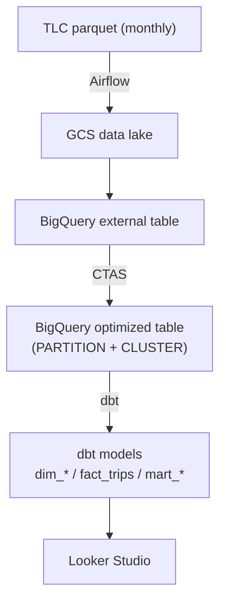

> Maintainable by one person, reproducible, and with a defensible answer to "why not X?" at every layer.

## One picture

Four layers, each doing exactly one thing:

| Layer | Tool | Job |
|---|---|---|
| IaC | Terraform | Make GCS / BigQuery / VM / SA / firewall reproducible |
| Orchestration | Airflow (single VM) | Monthly backfill, retries, cleanup |
| Warehouse | BigQuery | Turn parquet into a queryable, partitioned, clustered fact |
| Modeling | dbt core | Translate raw facts into business-readable mart tables |

## Why not the "more modern" options

The most common question is not "why these tools" but "why not Composer / Dataflow / Kafka". An honest answer:

- **Composer**: managed Airflow starts at roughly 10× the cost of one `e2-standard-2` — not worth it for a solo project.
- **Dataflow / Pub/Sub**: the upstream TLC data is monthly parquet files. "Stream" is a fake requirement here.
- **Snowflake / Redshift**: BigQuery's on-demand pricing and autoscaling are friendlier for low-frequency workloads.

The decision rule is one sentence: **one person should be able to rebuild the whole thing within 30 minutes after something breaks.**

## Repo tour

- [nyc_taxi_pipeline/terraform/main.tf](nyc_taxi_pipeline/terraform/main.tf) — ~140 lines of IaC covers all resources
- [nyc_taxi_pipeline/airflow/nyc_taxi_pipeline.py](nyc_taxi_pipeline/airflow/nyc_taxi_pipeline.py) — a 5-task DAG
- [nyc_taxi_pipeline/dbt/models/](nyc_taxi_pipeline/dbt/models/) — 1 fact + 2 dims + 3 marts

## What the rest of this series drills into

The next 16 posts go layer by layer: Terraform safety rails → DAG design → BigQuery partition/cluster → dbt modeling → testing → war stories → business insight. Each one focuses on a single concern and skips the architecture overview.
