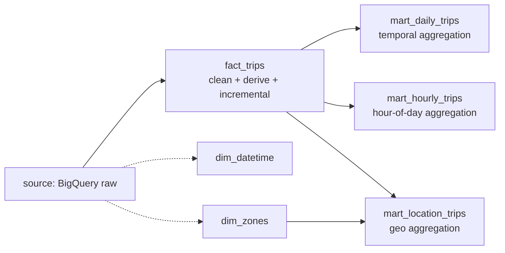

A dbt project starts to suffer at scale: the `models/` folder has 100+ `.sql` files, newcomers don't know where to read, and old hands don't know which downstream they'll break.

Three-layer modeling isn't a rule — it's a tool for **fighting that entropy**. This project only has 6 models, but the shape is already useful.

## What each layer does



| Layer | Who reads it | Change frequency | Key constraint |
|---|---|---|---|
| source/staging | Only downstream models | When upstream changes | 1:1 mapping, minimal logic |
| dim / fact | Marts + analysts | When business rules change | Unique keys, incremental strategy |
| mart | BI tools, APIs | When report needs change | Denormalized, wide, tuned to query pattern |

## fact_trips: the single source of truth

```sql
{{ config(
    materialized = 'incremental',
    unique_key = 'trip_id',
    incremental_strategy = 'merge',
    partition_by = {"field": "pickup_date", ...},
    cluster_by = ["pickup_location_id"]
)}}

SELECT
    TO_HEX(SHA256(CONCAT(
        CAST(VendorID AS STRING), '|',
        CAST(tpep_pickup_datetime AS STRING), '|',
        ...
    ))) AS trip_id,
    ...
    DATE(tpep_pickup_datetime)               AS pickup_date,
    EXTRACT(HOUR  FROM tpep_pickup_datetime) AS pickup_hour,
    EXTRACT(DAYOFWEEK FROM tpep_pickup_datetime) IN (1, 7) AS is_weekend,
    TIMESTAMP_DIFF(...) AS trip_duration_minutes
FROM {{ source('nyc_taxi', 'yellow_tripdata') }}
WHERE tpep_pickup_datetime IS NOT NULL
  AND trip_distance > 0
  AND total_amount > 0
```

Three decisions worth calling out:

1. **`trip_id` from a deterministic hash.** Upstream has no natural primary key but does have "this combination of fields is unique". SHA256 + `unique_key` makes merge re-runs idempotent.
2. **Derived columns materialized in the fact.** `pickup_date`, `pickup_hour`, `is_weekend`, `trip_duration_minutes` are used by every mart — compute them once instead of re-`EXTRACT`-ing in three places.
3. **Data-quality filters live here, not in marts.** `trip_distance > 0 AND total_amount > 0` is the definition of "what counts as a valid trip". Define it once.

## mart tables: wide, clustered to the query, no joins

```sql
-- mart_hourly_trips.sql
SELECT
    pickup_date, pickup_hour, is_weekend,
    COUNT(*), AVG(...), SUM(...)
FROM {{ ref('fact_trips') }}
WHERE pickup_date >= DATE_SUB(CURRENT_DATE(), INTERVAL {{ var('lookback_days', 90) }} DAY)
GROUP BY pickup_date, pickup_hour, is_weekend
```

One small thing: **there is no `JOIN dim_datetime`** in this mart. The fact already carries `pickup_hour` and `is_weekend`.

> A mart should be the shape a BI tool can use with a single `SELECT *`.

The only mart that does join a dim is `mart_location_trips` (to attach borough/zone labels). That kind of "dim provides labels" join is the one worth doing.

## What this layering actually buys you

1. **Marts are leaves** — adding or changing one does not propagate
2. **Changing the fact has a known blast radius** — dbt graphs the affected marts
3. **Data bugs localize fast** — mart wrong → check fact → check source. Three layers, three checkpoints.
4. **Materialization strategies can differ per layer** — fact is incremental + merge, marts are full-rebuild tables (small data, simple semantics)

## When it's overkill

- Fewer than ~5 models total
- One analyst, no downstream consumers
- `dbt run` finishes in seconds anyway

Any of those, and three layers is over-engineering — flat is fine. This project sits right at the threshold: six models, but the clarity gain is already visible.

> Files: [nyc_taxi_pipeline/dbt/models/fact_trips.sql](nyc_taxi_pipeline/dbt/models/fact_trips.sql), [nyc_taxi_pipeline/dbt/models/mart_hourly_trips.sql](nyc_taxi_pipeline/dbt/models/mart_hourly_trips.sql)
