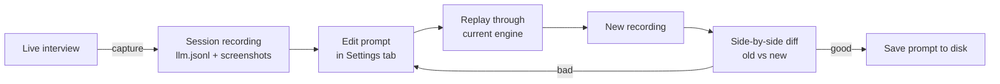
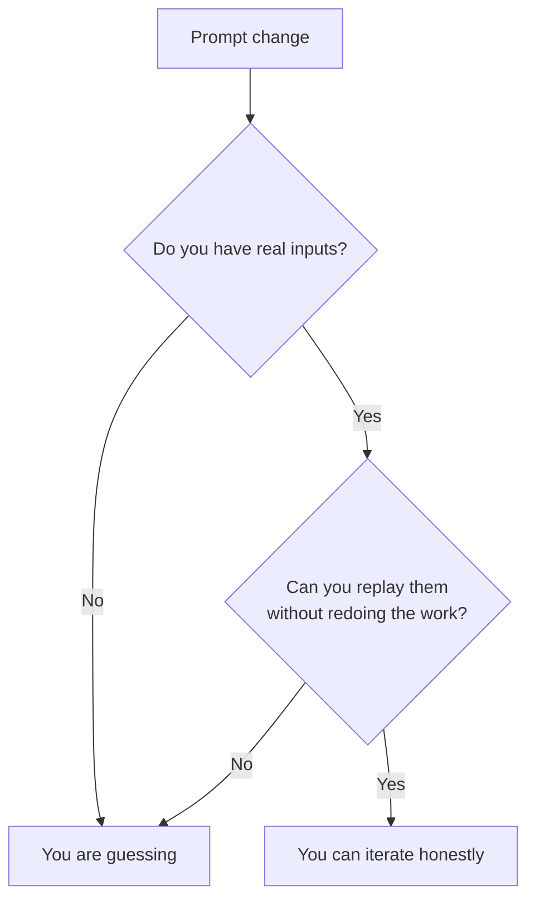

Every LLM tutorial teaches you how to *write* a prompt. Almost none teach you how to *verify a change to one*.

The default workflow is grim:

1. Edit the system prompt.
2. Open the playground, paste a question, eyeball the answer.
3. Convince yourself it's better.
4. Ship.
5. Find out two days later that your "better" prompt regressed on the question type you didn't test.

The reason this happens is structural: **you have no record of what real users asked, and no way to replay it through a tweaked prompt**. Playgrounds give you a REPL. You need a debugger.

This post walks through the record-and-replay loop I built for GhostPilot — a real-time interview-assistant app where prompt regressions are extremely visible and extremely expensive.

## The loop



The whole loop runs locally. No replay-to-cloud, no separate eval harness, no prompt CMS. Just three Python modules.

## Recording: append-only JSONL is enough

Every turn becomes three lines:

```jsonl
{"role": "user",       "content": "Tell me about a conflict with a teammate", "q_type": "behavioral", "kind": "text"}
{"role": "screenshot", "path": "screenshots/0001.jpg"}
{"role": "assistant",  "content": "[S] Two devs disagreed... [T] Ship Friday... [A] I proposed...", "tokens_in": 412, "tokens_out": 138, "model": "gpt-4o-mini"}
```

Three rules made this trivial:

- **One file per session.** No DB, no migrations. `Path.with_suffix(".zip")` archives it when the session ends.
- **One row per event, written immediately, flushed.** A crash mid-session loses one row, not the whole transcript.
- **Forward-slash paths only.** `Path.relative_to(...).as_posix()` so a Windows recording replays on macOS.

The third rule was a real Windows CI failure I shipped three times before noticing.

## The pairing problem

`llm.jsonl` is a stream of rows; replay needs **turns** (one question paired with one answer). The recorder writes `user` rows from `LLMEngine` and `assistant` rows from a separate UI accumulator that buffers tokens and flushes the full text on the terminal event. They land interleaved with optional `screenshot` rows for vision turns.

A defensive walker handles it:

```python
def iter_turns(session_dir):
    pending = None
    pending_shot = None
    for r in rows:
        role = r.get("role")
        if role == "user":
            pending = r           # if a previous user never got an assistant, drop it
            pending_shot = None
        elif role == "screenshot" and pending is not None:
            pending_shot = r
        elif role == "assistant" and pending is not None:
            yield Turn(... pending, pending_shot, r ...)
            pending = None
```

Orphan user rows (crash before assistant flushed) are silently dropped. Orphan screenshot rows are tied to the next user. The format degrades gracefully because the parser is the source of truth, not the writer.

## Replay: prompt overrides as a context manager

The replay function is engine-agnostic:

```python
async def replay_turn(engine, turn, prompt_overrides=None):
    if prompt_overrides:
        from src import prompt_loader
        with prompt_loader.override_prompts(prompt_overrides):
            await producer()
    else:
        await producer()
```

`override_prompts({q_type: text})` swaps the in-memory cache, runs the body, and restores the original — even on exception:

```python
@contextmanager
def override_prompts(mapping):
    saved = {k: _cache.get(k) for k in mapping}
    try:
        for k, v in mapping.items():
            _cache[k] = v
        yield
    finally:
        for k, prev in saved.items():
            if prev is None: _cache.pop(k, None)
            else:            _cache[k] = prev
```

This is the single most leveraged ten lines in the entire project. With it, A/B testing a prompt is one call. Without it, you'd have to write the prompt to disk, replay, restore, and pray no other thread reloaded the cache mid-flight.

## What I will not do

After a few weeks of dogfooding:

- **No automatic regression scoring.** Two answers being "the same" is a judgment call. A diff view is enough.
- **No prompt versioning system.** Git already does this. The replay's input is "a recording + an in-memory override," not "a versioned prompt artifact."
- **No semantic diff.** Plain text + scroll-synced split view catches 95% of regressions in 5% of the code.

## Takeaways



The minimum viable prompt debugger is:

1. Capture **the full prompt and the full answer** alongside metadata. Token counts alone are useless.
2. Pair user→assistant rows at write time so replay doesn't have to guess.
3. Make prompt overrides a context manager so swapping is a one-liner.
4. Ship a UI that closes the loop *inside the same app* — context switches kill iteration.

The whole feature is ~400 lines and 12 tests. It is, by a wide margin, the most useful thing I've added to this project.
