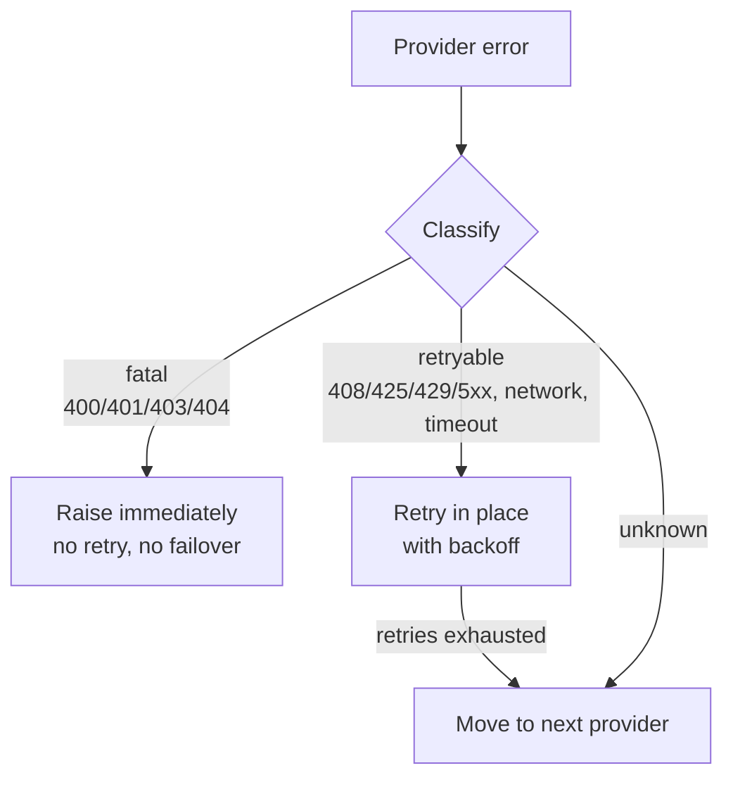
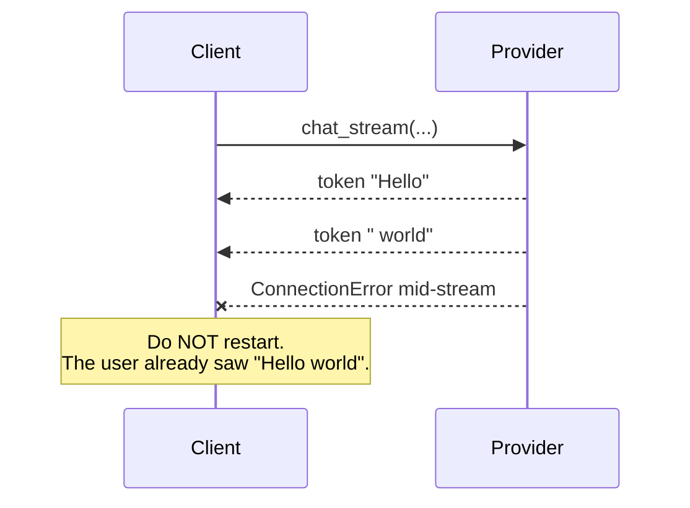
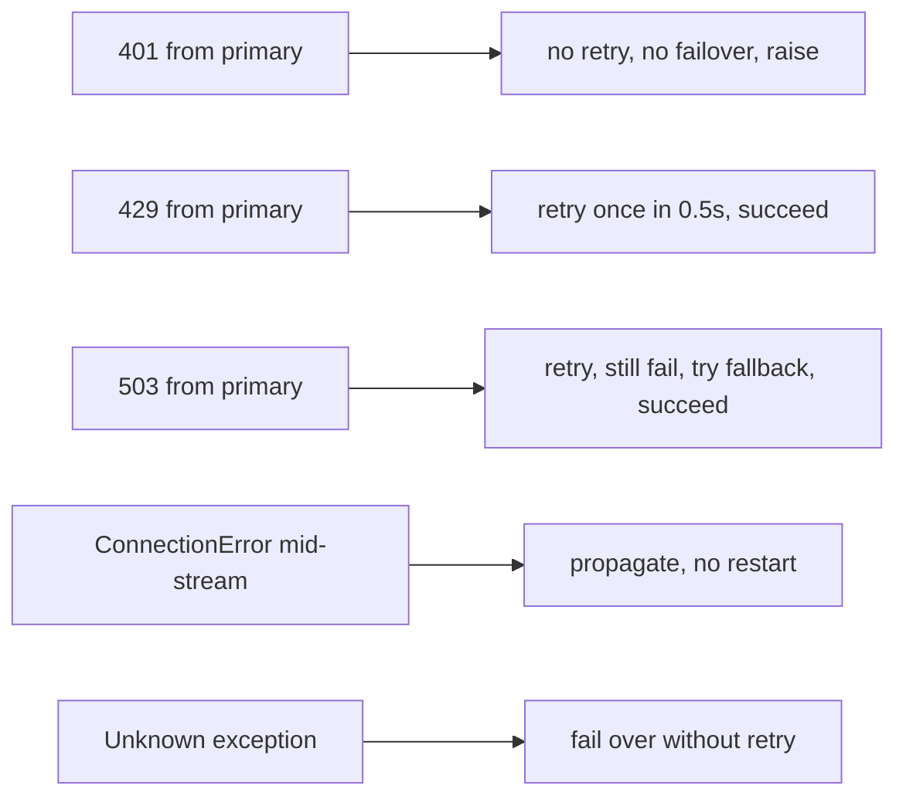

A bad retry loop is a strict upgrade over no retry loop, until it isn't.

Here's the failure mode I shipped, then fixed:

> A user rotated their DeepSeek API key. They forgot to update `.env`. Every LLM call hit 401 Unauthorized. The retry loop dutifully retried each call three times, then failed over to Gemini — which also got 401 because the user had pasted the DeepSeek key into the Gemini field. Total: **six network round-trips, six log lines, ~8 seconds of latency, identical result to giving up immediately.**

The fix is to classify the error *before* deciding whether to retry, and *before* deciding whether to fail over.

## Three buckets, not one



Three rules carry the whole design:

| Bucket | Why this action |
|--------|-----------------|
| **fatal** — `400/401/403/404`, "Invalid API key", "Bad request" | Switching providers can't fix a missing key. Retrying can't fix a malformed request. Both add latency and burn quota. |
| **retryable** — `408/425/429/5xx`, `TimeoutError`, `ConnectionError` | The same provider will probably succeed on retry. Switching providers loses session context (e.g. usage caches). Backoff first, then fail over if the provider is genuinely down. |
| **unknown** | Conservative: don't retry in place (could be fatal), but do try the fallback (the fallback might work). |

## The classifier is the entire trick

```python
_FATAL_STATUS = {400, 401, 403, 404}
_RETRYABLE_STATUS = {408, 409, 425, 429, 500, 502, 503, 504}

def classify_error(err) -> str:
    # 1) Structured status code from SDK exception
    status = getattr(err, "status_code", None) or getattr(err, "status", None)
    if status is None:
        resp = getattr(err, "response", None)
        if resp is not None:
            status = getattr(resp, "status_code", None)
    if status in _FATAL_STATUS:     return "fatal"
    if status in _RETRYABLE_STATUS: return "retryable"

    # 2) Exception class (network layer)
    name = type(err).__name__.lower()
    if any(s in name for s in ("timeout", "connection", "network")):
        return "retryable"

    # 3) String regex on str(err) — last resort, but worth it
    msg = str(err).lower()
    if re.search(r"\b(invalid api key|unauthorized|bad request)\b", msg):
        return "fatal"

    return "unknown"
```

A few things to notice:

- **Status codes are checked first** because they're the most reliable signal.
- **Exception class is second** because network errors don't carry HTTP status codes.
- **Regex on the message is last** and intentionally narrow. It catches the OpenAI-SDK case where a 401 was wrapped in a `RuntimeError` with the original message but no status.

## Retry with exponential backoff, *bounded*

```python
async def chat_stream(self, ...):
    for provider in [self.primary, *self.fallbacks]:
        for attempt in range(self.retries_per_provider + 1):
            try:
                async for delta in provider.chat_stream(...):
                    yield delta
                return
            except Exception as e:
                kind = classify_error(e)
                if kind == "fatal":
                    raise
                if kind == "retryable" and attempt < self.retries_per_provider:
                    await asyncio.sleep(self.backoff_base * (2 ** attempt))
                    continue
                break  # move to next provider
    raise  # all providers exhausted
```

Defaults: `retries_per_provider=1`, `backoff_base=0.5`. So a single retryable error costs 0.5s, then moves on. The worst case across two providers is `0.5 + 1.0 + 0 = 1.5s` before raising.

**One bounded retry per provider is almost always the right default.** Two is paranoid, three is hostile.

## Mid-stream errors are not retryable



If tokens have already been emitted to the UI, retrying the call would replay them — the user sees `Hello worldHello world, my name is...`. Worse, vision replays would re-bill the image. The right behavior is to let the error propagate to the UI as a stream interruption.

The implementation:

```python
async def chat_stream(self, ...):
    emitted = False
    try:
        async for delta in self._with_failover(...):
            emitted = True
            yield delta
    except Exception:
        if emitted:
            raise  # do not restart; surface to UI
        # else: failover already tried in _with_failover
        raise
```

## Observability is half the value

Every failover writes a single info event onto the UI queue:

```python
{"type": "info", "kind": "vision", "provider": "gemini",
 "note": "failover from openai", "error": "openai: 503"}
```

The overlay footer shows it for one second. That's enough for the user to know "DeepSeek is down, you're on Gemini" without staring at logs.

## Test matrix that earned its keep



Five tests. Five real production scenarios. Each one used to be a bug.

## TL;DR

- Classify errors into `fatal | retryable | unknown` before deciding.
- Retry in place at most once with exponential backoff.
- Fail over only after retries are exhausted *or* the error is unknown.
- Never retry once tokens have been emitted to the user.
- Surface every switch on the UI for one second.

The whole module is ~250 lines. It used to be ~80 and behaved much worse.
