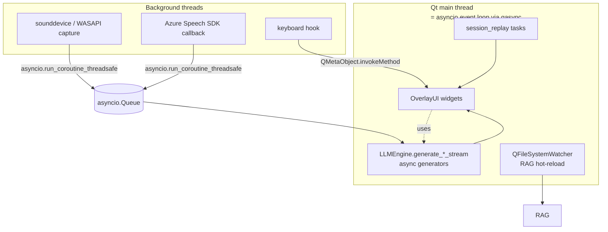
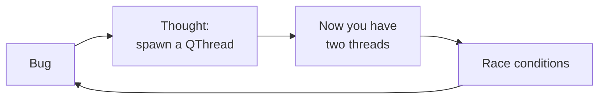

The Python desktop-app stack has a coordination problem.

- Qt wants to own the main thread.
- asyncio wants to own the event loop.
- Your audio capture wants a background thread.
- Your LLM stream wants to be an async generator.
- Your hotkey listener wants OS-level callbacks.

GhostPilot runs all five of these in one process, on Windows, without a single deadlock or threading bug. The glue is `qasync`, plus a small set of discipline rules. Here's what survived contact with production.

## The architecture



Rule 1: **everything async runs on the Qt thread.** Workers cross the boundary in exactly one of two ways.

## qasync in 10 lines

```python
import asyncio
from PyQt6.QtWidgets import QApplication
import qasync

app = QApplication(sys.argv)
loop = qasync.QEventLoop(app)
asyncio.set_event_loop(loop)

with loop:
    loop.run_until_complete(main())  # main() is an async coroutine
```

That's the entire integration. `qasync` is a Qt event loop that also runs asyncio callbacks. `await asyncio.sleep(0.1)` works, `loop.create_task(...)` works, and Qt slots fire on the same thread.

The trap: it is **one loop on one thread**. Anything that tries to spawn a second loop (a library that calls `asyncio.run(...)` internally, a thread that calls `asyncio.get_event_loop()`) will explode.

## Crossing the boundary, two patterns

### Worker thread → asyncio task

```python
def _on_audio_chunk(chunk: bytes) -> None:
    """Called from sounddevice's audio thread."""
    asyncio.run_coroutine_threadsafe(audio_queue.put(chunk), loop)
```

`run_coroutine_threadsafe` schedules a coroutine on the loop and returns a `concurrent.futures.Future`. Critically: it does *not* block the calling thread. The audio callback returns in microseconds.

### Worker thread → Qt widget

```python
def _on_hotkey():
    """Called from the keyboard hook thread."""
    QMetaObject.invokeMethod(ui_asr, "toggle_visibility",
                             Qt.ConnectionType.QueuedConnection)
```

`QueuedConnection` posts the call to the Qt event loop. The target slot runs on the Qt thread on the next iteration.

**Never touch a QWidget from a non-Qt thread.** Even setting `widget.setText(...)` from a worker thread will crash, eventually, in a way that doesn't reproduce.

## Async generators are the right shape for LLM streams

```python
class LLMEngine:
    async def generate_answer_stream(self, question, ui_queue, *, q_type=None):
        async for delta in self.text_provider.chat_stream(messages, model=self.model):
            await ui_queue.put({"type": "token", "text": delta.text})
        await ui_queue.put({"type": "usage", ...})
```

The UI consumer is dead simple:

```python
async def ui_updater():
    while True:
        msg = await ui_queue.get()
        if msg["type"] == "token":
            overlay.append_token(msg["text"])
        elif msg["type"] == "usage":
            overlay.flush_footer(msg)
```

This shape gives you, for free:

- Backpressure (the queue fills if the UI is slow).
- Cancellation (cancel the producer task, the queue drains, the consumer keeps going).
- Recording (a second consumer tees tokens to disk — that's how the session recorder works).

## Cancellation across the boundary

Long-running replays need a Cancel button. The pattern:

```python
# UI thread (Sessions tab)
self._cancel_event = asyncio.Event()  # safe because qasync = same thread

def _on_cancel_clicked(self):
    self._cancel_event.set()

# Replay task
async def _run():
    for i, turn in enumerate(turns, 1):
        if cancel_event.is_set():
            break
        await session_replay.replay_turn(engine, turn)
```

Crucial detail: **the in-flight turn runs to completion.** Cancelling it mid-stream would leave a half-finished assistant row in the recording. The cancel is checked **between** turns, never within them.

This is a general principle: **cancellation points are negotiated, not imposed.** A "cancel everything right now" is almost always wrong; the producer needs to land on a clean state.

## QFileSystemWatcher + asyncio: an unexpected pairing

The RAG knowledge base hot-reloads when a markdown file under `knowledge/` changes. Naively, the watcher's `directoryChanged` signal fires on the Qt thread — but rebuilding the BM25 index takes ~500ms and would freeze the UI.

```python
watcher.directoryChanged.connect(
    lambda path: loop.create_task(rebuild_kb_async())
)
```

`loop.create_task(...)` is the bridge. The Qt slot returns immediately; the rebuild runs as an asyncio task that yields back to the loop between chunks. UI stays responsive. No thread, no lock, no manual `QThread` boilerplate.

This is the unsung superpower of qasync: **the Qt thread *is* the asyncio thread, so you never need a thread for "non-blocking but long-running" work.** Make it an async task and it just yields.

## What I will not do again



I started this project with a `QThread` per worker. Every interesting bug was a race condition between Qt's event loop and the worker thread. The rewrite to "one qasync loop, workers are thin shims that marshal back via `run_coroutine_threadsafe`" deleted the entire category.

If you reach for `QThread`, stop and ask: can this work be an async task instead? Almost always, yes.

## Recap

| Need | Tool |
|------|------|
| Streaming LLM output to UI | async generator → `asyncio.Queue` → consumer task |
| OS callback (audio, hotkey) → async logic | `asyncio.run_coroutine_threadsafe` |
| OS callback → Qt widget | `QMetaObject.invokeMethod(..., QueuedConnection)` |
| File system watcher → expensive work | qasync slot → `loop.create_task` |
| Long task cancellation | `asyncio.Event` checked at clean boundaries |
| **Anything else that wants a thread** | First try: make it an async task |

One loop. One thread. One mental model. The whole app fits in your head.
