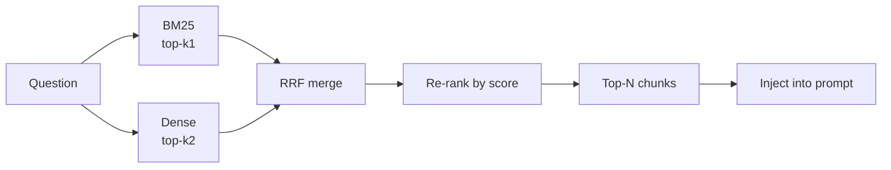
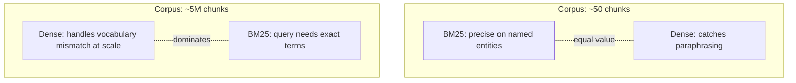
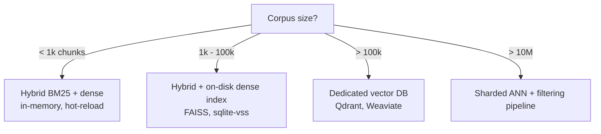

Most RAG content assumes you have a vector DB, an embeddings budget, and tens of thousands of documents. The reality for personal tools, internal wikis, and onboarding bots is different: **you have a handful of markdown files and a handful of seconds to retrieve from them.**

GhostPilot's knowledge base is one file: `knowledge/resume.md`, ~50 chunks after splitting. Retrieval feeds question-answering during interviews. Latency budget: under 200ms. Embedding cost budget: ideally zero per query.

A dense-only retriever would be the wrong tool here. Here's what actually works.

## The retrieval pipeline



Three observations drove this:

1. **BM25 alone catches all the high-recall named-entity queries.** "Did you work at Stripe?" — `Stripe` appears in exactly one chunk. Dense retrieval will return the right chunk *plus three near-misses about other fintech experience*. BM25 returns one chunk with a huge score gap.
2. **Dense alone catches all the paraphrased queries.** "Tell me about a time you mentored someone" — the word `mentored` may not appear in the resume, but `helped junior engineers` and `led the intern program` will embed close.
3. **Either alone gets ~70% of queries right. Together they get ~95%.**

## Reciprocal Rank Fusion in 5 lines

Forget weighted score combinations — the scores are on different scales and weights are a nightmare to tune. RRF is parameter-free and works:

```python
def rrf(rankings: list[list[str]], k: int = 60) -> list[tuple[str, float]]:
    scores: dict[str, float] = {}
    for ranking in rankings:
        for rank, doc_id in enumerate(ranking):
            scores[doc_id] = scores.get(doc_id, 0) + 1.0 / (k + rank)
    return sorted(scores.items(), key=lambda x: -x[1])
```

`k=60` is the canonical choice from the original RRF paper. Larger `k` flattens the rank decay; smaller `k` makes top-1 matter more. 60 is fine. Stop tuning it.

## Why BM25 still wins on small corpora



The dense-retrieval orthodoxy assumes the corpus is large enough that vocabulary mismatch is the main failure mode. On a 50-chunk corpus:

- Every named entity appears in 1-3 chunks. BM25's IDF term gives them huge weight. Dense embeddings smear this signal across "semantically similar" chunks.
- The query language is close to the document language (you're paraphrasing your own resume). Dense retrieval's vocabulary-bridging superpower is underused.
- Most importantly: **the failure modes are different.** Dense fails by returning plausible-but-wrong neighbors. BM25 fails by returning nothing for paraphrased queries. Hybrid covers both.

## Cost: ~zero per query

```python
class RAGManager:
    def __init__(self, chunks):
        self.bm25 = BM25Okapi([tokenize(c) for c in chunks])
        # Embeddings computed once at startup, cached on disk.
        self.embeddings = self._load_or_compute(chunks)

    def retrieve(self, query: str, top_n: int = 4):
        bm25_ranking = self._bm25_topk(query, k=10)
        dense_ranking = self._dense_topk(query, k=10)
        merged = rrf([bm25_ranking, dense_ranking])
        return [self.chunks[i] for i, _ in merged[:top_n]]
```

Per-query cost:

| Step | Cost |
|------|------|
| BM25 | `O(|query| × |corpus|)`, ~1ms |
| Dense | one embedding API call OR one local model forward (sentence-transformers all-MiniLM ~30ms on CPU) |
| RRF merge | `O(k)`, microseconds |
| **Total** | **30-150ms, $0 if local embeddings** |

GhostPilot uses `sentence-transformers/all-MiniLM-L6-v2` locally. 80MB download, no API keys, runs on CPU. For 50 chunks, the embedding *computation at startup* is the dominant cost (~3 seconds, once). Per-query embedding of the user's question is ~30ms.

## Hot reload because the corpus is small

A 50-chunk corpus rebuilds in <1 second. So instead of a separate ingestion pipeline:

```python
watcher = QFileSystemWatcher([str(knowledge_dir)])
watcher.directoryChanged.connect(
    lambda: loop.create_task(rag_manager.rebuild_async())
)
```

Edit a markdown file, save, the index updates before you've Alt-Tab'd back to the overlay. This is impossible at 5M chunks; it's trivial at 50.

## When to switch to dense-only or a vector DB



The threshold for needing a vector DB is much higher than the marketing implies. Below ~10k chunks, hybrid retrieval in process beats anything else on latency, cost, and operational complexity combined.

## Things that didn't make the cut

- **Cross-encoder re-ranker.** Tested, added ~150ms and ~3% recall. Not worth it at this scale.
- **Query expansion.** The LLM does this implicitly — adding it in retrieval was redundant noise.
- **Chunk overlap.** Tried 20% overlap, made BM25 fire twice on the same content, hurt RRF. Pure non-overlapping chunks at sentence boundaries won.

## TL;DR

For corpora under ~10k chunks:

1. Use BM25 *and* dense embeddings. Each catches what the other misses.
2. Merge with RRF, not weighted scores. Stop tuning weights.
3. Keep everything in memory. Hot-reload on file change.
4. Run embeddings locally. The 80MB model is enough.
5. Resist the urge to add a vector DB. You don't need it.

The whole `rag_manager.py` is ~200 lines including the watcher. Total p95 retrieval latency on my machine: 47ms.
