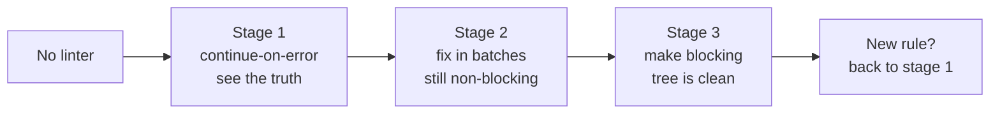
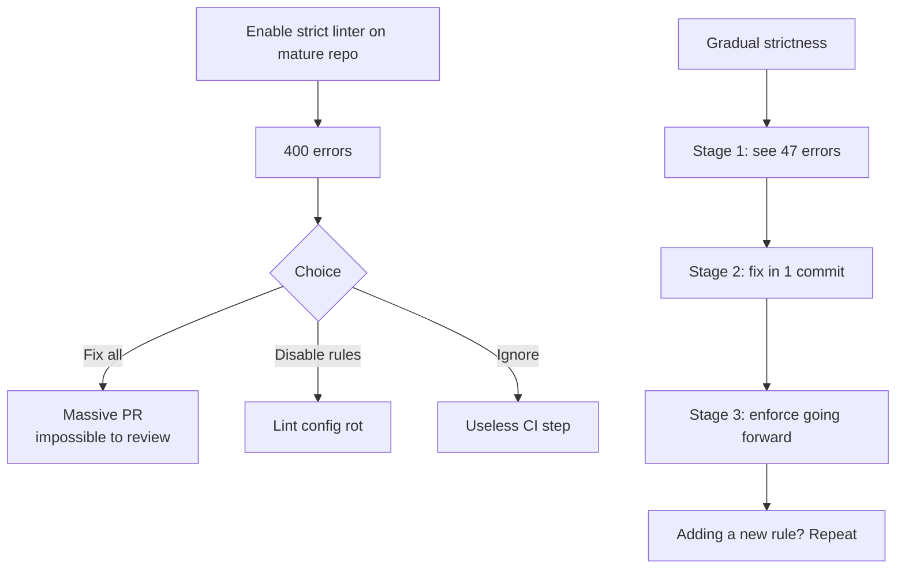

Most lint cleanups happen the wrong way:

1. Run the linter on a mature repo.
2. See 400 errors.
3. Disable half the rules.
4. Lower the severity to "warning."
5. Ship `continue-on-error: true` in CI.
6. Never look at the warnings again.

Six months later the lint config is a graveyard of disabled rules, the CI step is a placebo, and adding a new rule is a project. The repo never gets cleaner.

Here's a better path: **gradual strictness**. Three stages, each cheap, each independently shippable.

## The three stages



The key insight: **the only stage where you tolerate noise is stage 1, and only briefly.** The point of stage 1 is to see the real shape of the problem, not to live there.

## Stage 1: install, run, collect — 5 minutes

```yaml
# .github/workflows/ci.yml
- name: Lint
  run: ruff check .
  continue-on-error: true   # explicitly temporary
```

`continue-on-error` is doing one job: surfacing the violations in the CI log so you can see them. Not blocking the build. Not silencing them.

```toml
# pyproject.toml — start permissive
[tool.ruff]
line-length = 100
target-version = "py39"

[tool.ruff.lint]
select = ["E", "F", "W", "I"]  # errors, pyflakes, warnings, import sorting
```

That's the minimum useful ruleset. Add more later.

## Stage 2: batch-fix, don't piecemeal-fix

```bash
ruff check . --output-format=concise
# Found 47 errors.
```

Resist the temptation to fix them one at a time across 47 PRs. Two passes:

```bash
ruff check . --fix       # safe autofixes
ruff check .             # what's left needs eyes
```

The remaining errors fall into three groups:

| Group | Strategy |
|-------|----------|
| Real bugs (F841 unused var, F401 unused import) | Fix immediately, often with `--fix`. |
| Style (E501 line too long, I001 import order) | `--fix` handles 95%. |
| Disagreements (E741 ambiguous name `l`) | Either rename or add an inline `# noqa: E741` with a reason. |

In this repo, stage 2 was one commit:

```
chore(d): remove dead self.text_client, fix lint, make ruff blocking
- llm_engine: remove dead self.text_client legacy raw-SDK assignment
- main.py: drop unused kb_watch_task local (F841)
- settings_ui.py: hoist pathlib.Path import to module top instead of __import__ trick
- tests: drop unused imports (AsyncMock, Path, pytest)
- .github/workflows/ci.yml: remove continue-on-error from ruff step
```

7 files, 8 insertions, 16 deletions. Now the lint passes.

## Stage 3: flip the switch

```yaml
# .github/workflows/ci.yml
- name: Lint
  run: ruff check .
  # continue-on-error removed — must pass
```

This is the entire stage 3 change. One line, deleted.

Now any future violation is a CI failure, surfaced on the PR, before review. The cost of fixing it is 10 seconds (`ruff check . --fix`). The cost of *not* enforcing it is unbounded.

## Why this works where "enable everything at once" fails



The mature-repo failure mode happens because the team conflates **"the code needs to comply with this rule"** with **"the rule needs to be on right now."** Decoupling them buys you the breathing room to actually fix things.

## What to do when adding a new rule

The exact same loop:

1. Add the rule with `continue-on-error: true` (or use `# noqa` on existing violations).
2. Run the linter, count the new violations.
3. Fix them in one batch — typically one commit per category.
4. Remove `continue-on-error`.

If the count of violations is too high to fix in one batch, the rule is too aggressive for this codebase. Either narrow its scope (`per-file-ignores`) or don't add it.

## ruff-specific tricks worth knowing

```toml
[tool.ruff.lint.per-file-ignores]
# Test files can have unused imports (fixtures) and ambiguous names
"tests/*" = ["E741"]
# Generated migrations
"migrations/*" = ["E501", "I001"]
```

```toml
[tool.ruff.lint.isort]
known-first-party = ["src"]
```

```bash
# Only fail on rules introduced after this date
ruff check --select=ALL --ignore=ANN --ignore=D .
```

## The lesson

**A linter that doesn't fail the build is a comment in a config file.** It signals intent without enforcing it, and intent decays. The gradual path lets you go from zero to enforced in three small steps, each one shippable on its own day, without ever blocking the team on a single mega-cleanup.

In this repo: from "no linter" to "ruff CI-blocking on Windows × Py 3.9 + 3.12" was three commits over two days. Zero painful PRs. The repo has stayed clean since.
