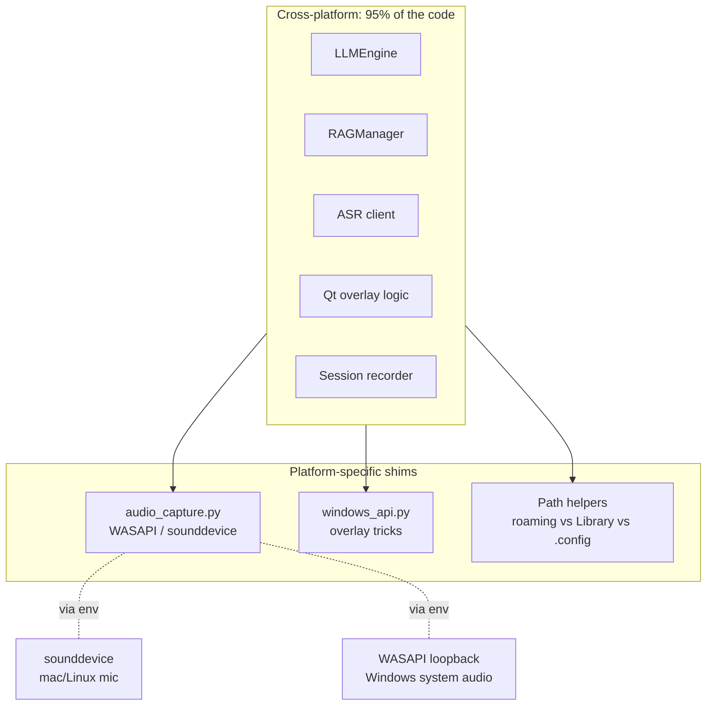
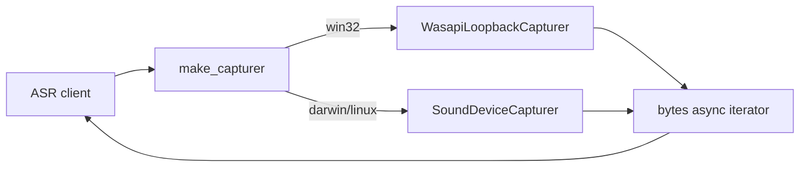
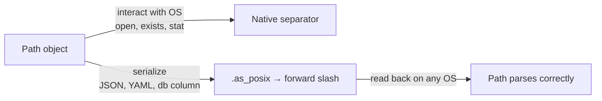

GhostPilot is a Windows-only app. The stealth-overlay trick (click-through, capture-resistant) only works with `SetWindowDisplayAffinity` and friends. System-audio loopback uses WASAPI. The whole pitch is Windows-specific.

And yet I develop on macOS.

The repo runs end-to-end on my MacBook — minus the OS-specific overlay tricks — within seconds of `git clone`. The CI matrix is Windows-only. Nothing is faked. Nothing is mocked at the architecture level.

Here's the discipline that makes that possible. It's three rules.

## The shape



Cross-platform code doesn't know which platform it's on. Platform-specific code is small, named, and isolated.

## Rule 1: one capability, one backend abstraction

The audio module is the canonical example:

```python
# src/audio_capture.py
BACKEND = os.environ.get("AUDIO_BACKEND", "auto")

def make_capturer() -> AudioCapturer:
    backend = BACKEND
    if backend == "auto":
        backend = "wasapi" if sys.platform == "win32" else "sounddevice"
    if backend == "wasapi":
        from src._audio_wasapi import WasapiLoopbackCapturer
        return WasapiLoopbackCapturer()
    if backend == "sounddevice":
        from src._audio_sounddevice import SoundDeviceCapturer
        return SoundDeviceCapturer()
    raise ValueError(f"unknown AUDIO_BACKEND: {backend}")
```

Both `WasapiLoopbackCapturer` and `SoundDeviceCapturer` implement the same async interface:

```python
class AudioCapturer(Protocol):
    async def start(self) -> AsyncIterator[bytes]: ...
    async def stop(self) -> None: ...
```

Calling code never branches on platform. It calls `make_capturer()` and iterates. The factory is the only place that knows.



**The win**: when a macOS dev tests "does the ASR pipeline work end-to-end?", they `export AUDIO_BACKEND=sounddevice`, speak into the mic, and the entire app runs. They lose system-audio loopback (a Windows-specific feature requiring BlackHole on Mac) but they can test 100% of the application logic. Iterations don't require a Windows VM.

## Rule 2: every "where do I store this?" question goes through one function

OS file conventions are different and silent. Get it wrong once, your app writes to `~/Documents/GhostPilot/` on Windows and `$APPDATA/GhostPilot/` on macOS, and now you have a phantom data directory you'll find six months later wondering "what is this."

Centralize:

```python
def _user_prompt_dir() -> Path:
    if sys.platform == "win32":
        base = os.environ.get("APPDATA") or str(Path.home() / "AppData" / "Roaming")
        return Path(base) / "GhostPilot" / "prompts"
    if sys.platform == "darwin":
        return Path.home() / "Library" / "Application Support" / "GhostPilot" / "prompts"
    return Path.home() / ".config" / "GhostPilot" / "prompts"
```

Every "writable user data" lookup goes through a function like this. Three branches, one place. If I get the macOS convention wrong, I fix it in one file.

The recordings directory does the same. The keyring lookup does the same. The cache directory does the same.

## Rule 3: paths inside files are always POSIX

This is the rule I learned the hard way, three Windows CI failures in a row:

```python
# Wrong — works on Mac, breaks on Windows when the file is consumed cross-OS
{"path": str(out.relative_to(self._dir))}
# → "screenshots/0001.jpg" on Mac
# → "screenshots\\0001.jpg" on Windows  ← breaks readers

# Right — same string on every platform
{"path": out.relative_to(self._dir).as_posix()}
```

`Path` is platform-aware for *interacting with the OS*. For *serializing* (JSONL, config files, anything that might be read on a different machine), normalize to forward slashes. `.as_posix()` is the magic. Always use it before writing a path string to disk.



## CI matrix: test where you ship, dev where you're fast

```yaml
# .github/workflows/ci.yml
strategy:
  matrix:
    os: [windows-latest]
    python-version: ["3.9", "3.12"]
```

Note: **Windows only.** I don't run CI on macOS even though I develop there. Here's why:

- The macOS dev experience is "import + run pytest + ruff." That's already verified by my local pre-commit muscle memory.
- The thing that breaks on Windows is *the platform-specific 5%*. Adding macOS to CI would catch nothing the Windows runner doesn't, and would double my CI minutes.
- **Python 3.9 + 3.12 matrix matters more than OS matrix.** Half the bugs are 3.9 syntax that 3.12 silently accepts (PEP 604 unions, walrus in comprehension, etc.).

The local guard:

```python
# At the top of every module using new-style hints
from __future__ import annotations
```

This single line makes `list[str] | None` parse on 3.9 (as a string, deferred). Without it, the import crashes on the Windows runner with a `TypeError` that doesn't fire on my Mac because I'm on 3.13.

## What the macOS dev gets — and doesn't

What works on macOS clone-to-running:

- All tests (102/102 pass)
- Lint, type check
- ASR pipeline with `AUDIO_BACKEND=sounddevice`
- LLM streaming, RAG retrieval, session record/replay
- Settings UI, prompts editor, sessions viewer

What doesn't work — and is fine:

- The stealth overlay (Windows API)
- System-audio loopback (needs BlackHole bridge)
- Hotkey listener (Windows-specific implementation)
- The build target (PyInstaller spec is Windows-only)

**95% of the bugs live in the 95% of the code that's cross-platform.** That's the part the macOS dev can iterate on. The 5% that's Windows-only gets manual verification on a Windows VM at release time, not every commit.

## The summary

| Discipline | What it buys |
|------------|--------------|
| Backend abstraction with env-var override | macOS dev can run the full app, not a stub |
| One function per "where does data live?" | No phantom directories, easy to fix when wrong |
| `.as_posix()` for serialized paths | Recordings replay cross-OS |
| Windows-only CI, multi-Python matrix | Catch the real bugs (3.9 vs 3.12), skip the fake ones |
| `from __future__ import annotations` at the top of every module | 3.9 keeps parsing |

You can build a Windows-only app from a Mac. You just have to draw the line cleanly between *what your app does* and *how it does it on this specific OS*. Cross-platform code is the asset. Platform-specific shims are the cost. Keep the ratio honest and the dev loop stays tight.
