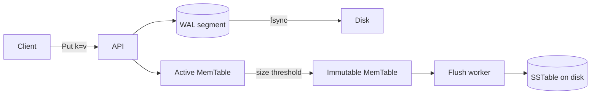
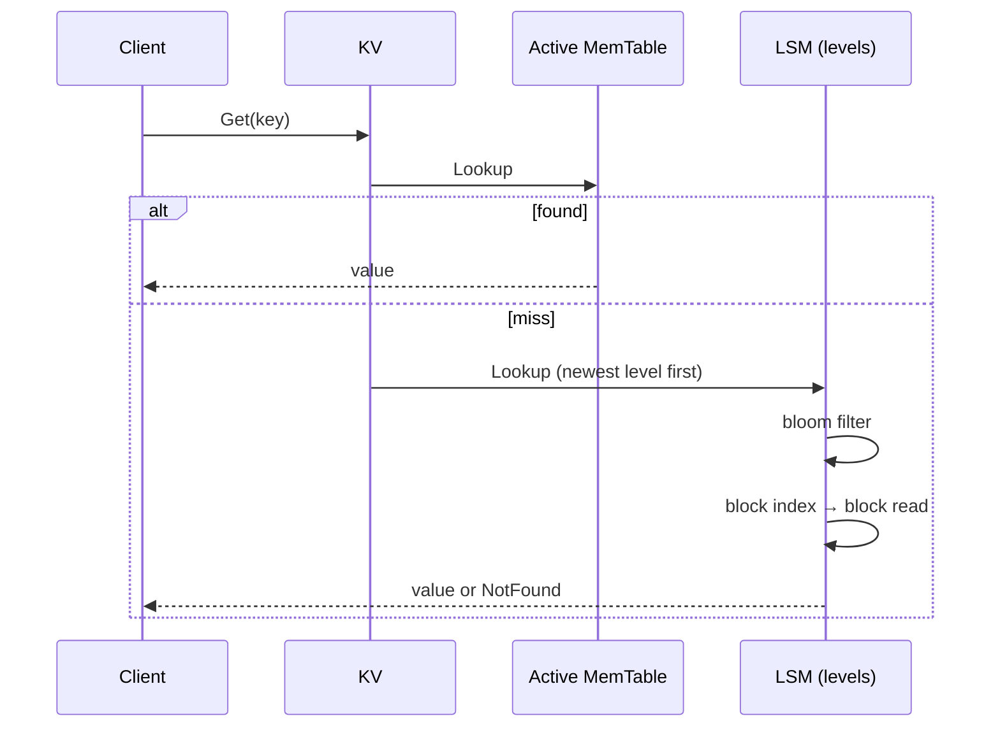

> The minimum viable LSM is three boxes and one rule: every byte you
> acknowledge must already be on disk.

When people say "LSM-Tree", they usually mean something the size of
RocksDB — version sets, MANIFEST logs, block caches, six levels of
compaction. That's the destination, not the entry point. The entry
point is much smaller: three components and a write path that fsyncs
before returning.

This post walks through MiniKV's minimum closed loop:



## The rule: never ack before fsync

The write path is small enough to memorise:

```go
// kv/kv.go — pseudocode
db.mu.Lock()
seq := db.nextSeq()
if err := db.wal.Append(seq, key, val); err != nil { ... }   // (1) WAL
db.memtable.Put(seq, key, val)                                // (2) MemTable
db.mu.Unlock()
return nil                                                    // (3) ack
```

Three lines, one invariant: step (1) durably commits the record before
step (3) returns. After a crash, the WAL is replayed into a fresh
MemTable and the user sees the same store they last acked.

In MiniKV that fsync policy is a knob — see
[`Config.SyncMode`](../kv/kv.go) — but the only mode that actually
survives power loss is `SyncAlways`. The default is `SyncAlways` for
exactly that reason.

## The three components

### WAL: append-only, CRC-checked, segmented

The WAL ([`kv/wal.go`](../kv/wal.go)) is a directory of fixed-named
segment files. Each record carries a CRC32C so we can stop replay at
the first torn write instead of reading garbage into the MemTable.

```
+--------+--------+-------+------+---------+
| length | crc32c | seq   | key  |  value  |
+--------+--------+-------+------+---------+
```

Segmenting matters for two reasons:

1. **Truncation**: when a MemTable is flushed to an SSTable, every WAL
   record that contributed to it becomes redundant. Deleting whole
   segment files is `unlink(2)`. Truncating a single huge file is a
   surgical operation that needs careful fsync ordering.
2. **Rotation latency**: an `Append` to a 4 MiB segment fsyncs 4 MiB
   worth of dirty pages. Rotating to a fresh segment every N MiB caps
   per-call latency.

### MemTable: a skip list keyed by `(user_key, seq desc)`

The MemTable ([`kv/memtable.go`](../kv/memtable.go)) is a skip list
because:

- We need ordered iteration for flush (writing an SSTable in key
  order) and for range scans.
- We need concurrent reads alongside the single writer that holds the
  store-wide mutex.
- A skip list gives both in O(log n) without the rebalancing pain of a
  red-black tree.

Entries are keyed by `(user_key, seq desc)`: a newer write for the
same key sorts before the older one, so a point lookup just takes the
first match.

### SSTable: immutable, sorted, sealed

When the MemTable hits its size budget, it is sealed (made immutable)
and a fresh one takes over. A background flush worker drains the queue
of immutable MemTables into SSTables on disk.

An SSTable is just three things glued together:

```
+----------+-----------------+--------+-------+--------+
| header   | data blocks ... | bloom  | index | footer |
+----------+-----------------+--------+-------+--------+
```

The block layout has its own [dedicated post](02-sstable-v4-format.md);
for the minimum loop you just need to know that an SSTable is sorted,
immutable, and has a sparse index so a point lookup is one binary
search plus one block read.

## What the read path looks like



Newer always wins because we walk from MemTable → L0 → L1 → ... → Ln,
and within each SSTable the sequence number breaks ties.

## What you do *not* need on day one

Things MiniKV grew later, none of which the minimum loop needs:

- A MANIFEST log — you can rebuild the live SSTable set from a
  directory scan until you care about atomic flush commits.
- A block cache — first build it correct, then measure, then cache.
- Compaction strategies — a single "merge L0 when it has K files" rule
  gets you running.
- Snapshots, transactions, TTL, replication — all bolt onto the loop
  above without changing it.

## Verifying the invariant

The one test that matters more than all the others is the crash test:
write something, ack it, kill the process with `SIGKILL`, restart,
read it back. MiniKV's version of that test lives in
[`tests/faultinject_test.go`](../tests/faultinject_test.go) and is the
subject of [its own post](12-sigkill-testing.md). If that test passes,
your WAL works. If it doesn't, nothing else matters.
