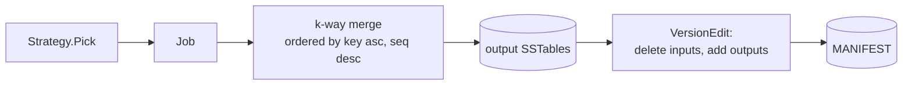
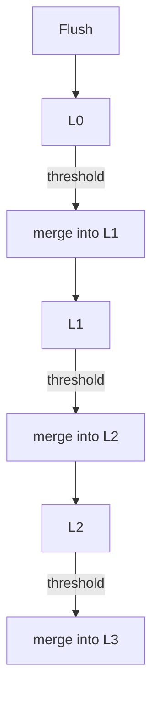
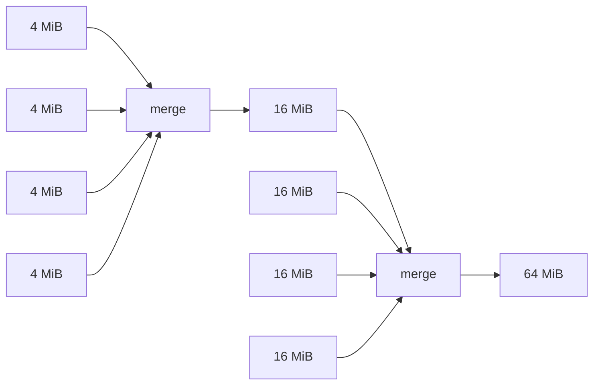

> Two compaction strategies, one merge kernel. The Strategy interface
> is small enough to fit on a napkin and the implementations are
> mostly bookkeeping.

Compaction is the part of an LSM engine where the academic papers
suddenly start to disagree. "Leveled" and "size-tiered" optimise for
opposite ends of the write/read amplification trade-off, and most
real-world engines (RocksDB, Cassandra, ScyllaDB) let you pick.

MiniKV implements both and shares the entire merge kernel between
them. This post is about *how that sharing is structured*.

## The strategy interface

The whole interface is, in spirit:

```go
type Strategy interface {
    // Pick returns the next set of SSTables to compact, or nil if
    // nothing needs to be done right now.
    Pick(version *Version) *Job
}
```

A `Job` says "merge these input files, producing output at this
level". The compaction worker takes the job, runs the merge, and
applies the resulting `VersionEdit` to the MANIFEST. That merge
worker is the same code for every strategy.



## Leveled

The leveled strategy
([`kv/compaction.go`](../kv/compaction.go)) keeps levels
exponentially larger as you go deeper:

- **L0** collects new SSTables produced by memtable flushes. Files in
  L0 may overlap in key range with each other (because they came from
  separate memtables).
- When L0 reaches `Config.Level0Fanout` files, every L0 file plus any
  overlapping L1 file is merged into L1.
- L1 and deeper hold non-overlapping files. When a level reaches
  `Config.LevelNFanout` files (or bytes), it is merged into the next
  level.



The good: a read touches at most one file per level (modulo L0), so
read amplification is small. The bad: every key gets rewritten roughly
once per level, so write amplification grows with the number of
levels.

## Size-Tiered

The size-tiered strategy buckets files by power-of-two size, ignoring
levels. When a bucket has at least `Level0Fanout` files of similar
size, they merge in place. The output ends up in the next-larger
bucket and may itself be merged later.



The good: each key gets rewritten roughly `log N` times total, not
once per level. The bad: many files may simultaneously contain the
same key, so a point lookup may have to probe many SSTables (the
Bloom filter helps here).

The trade is **write throughput** (size-tiered wins) versus **read
latency on hits** (leveled wins).

## The merge kernel

Both strategies feed a single function: a k-way merge across input
SSTables, output ordered by `(user_key asc, seq desc)`. Conceptually:

```go
// Pseudocode
iters := openIterators(inputs)
heap := newKeyHeap(iters)              // ordered by (user_key, seq desc)
var lastKey []byte
for !heap.empty() {
    e := heap.pop()
    if bytes.Equal(e.Key, lastKey) {
        continue                       // older write for the same key
    }
    lastKey = e.Key
    if isDroppable(e) {                // tombstone or expired TTL,
        continue                       // and no deeper level exists
    }
    writer.Add(e)
}
```

Two subtleties carry their weight:

1. **`(key asc, seq desc)` ordering**: dedup is as simple as "skip if
   key equals the last key written". The first occurrence wins, and
   because we ordered by `seq desc`, that's the newest write.

2. **`isDroppable` requires the level context**: a tombstone can only
   be dropped if no deeper level holds an older value for the same
   key. The strategy tells the merge kernel "you are producing output
   at level L; below you is empty" → the kernel knows it can drop.
   This is why deletes "show up" in reads until they propagate to the
   bottom level; see the [tombstones post](04-tombstones-and-ttl.md).

## Why share the kernel?

The merge kernel touches every byte of every input. It is the
performance-critical loop, the correctness-critical loop, *and* the
crash-safety-critical loop (it talks to the MANIFEST). You want
exactly one of it.

The cost of sharing is the strategy interface: a single `Pick`
returning a `Job`. That cost is dwarfed by the alternative — two
parallel merge implementations that subtly disagree on tombstone
dropping.

If you only ever take one design idea from this codebase, take this
one. "One kernel, many policies" is the right shape for any pluggable
batch processor, not just compaction.
