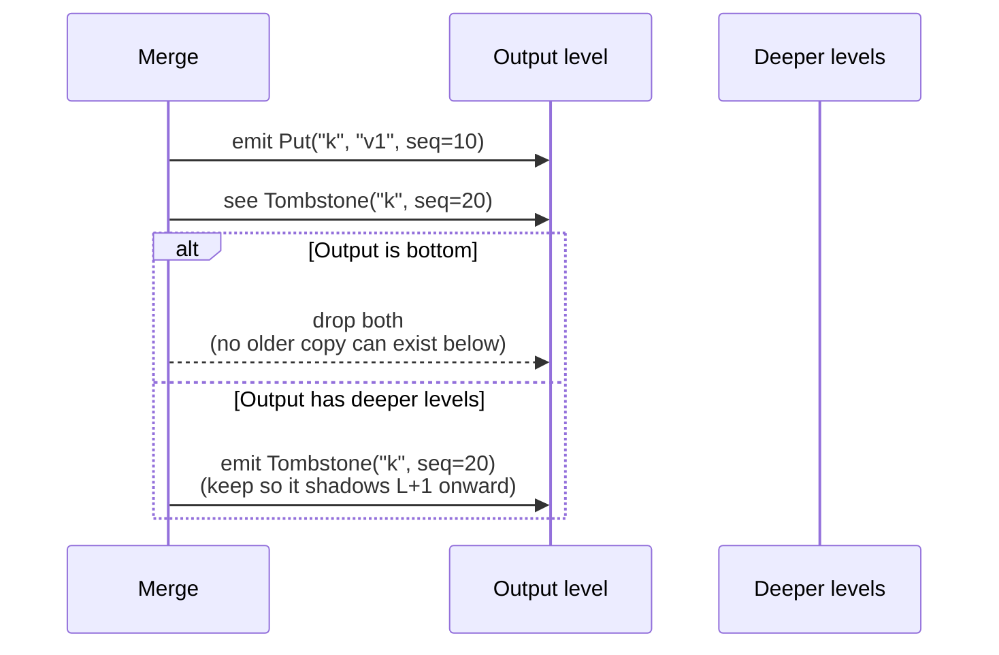

> The hardest thing about deletion in an LSM tree is convincing
> yourself the data is *really* gone.

In a B-tree, deleting a key is just removing it from a node. In an
LSM, deletion is *itself a write* — a tombstone — and that tombstone
has to live long enough to shadow every older copy of the key still
on disk. This post is about when tombstones (and expired TTL entries)
can finally be dropped.

## Why deletes can't just delete

An LSM is append-only. When you `Delete("k")`, the engine:

1. Appends a tombstone record to the WAL.
2. Inserts a tombstone into the MemTable.

That's it on the write path. The key `k` may still exist in:

- An immutable MemTable waiting to flush.
- Multiple L0 SSTables.
- L1, L2, ... SSTables.

If we drop the tombstone before all of those copies are gone, a
future `Get("k")` will resurrect the older value. The tombstone has
to survive long enough to *outlive every older write for the same
key*.

## The rule

In MiniKV's compaction kernel ([`kv/compaction.go`](../kv/compaction.go)):

> A tombstone can be dropped iff the compaction output is going to a
> level with **no deeper level holding a key range that could overlap
> this key**.

For the leveled strategy this simplifies to: "is the output the
bottom level?". For size-tiered it requires checking that no larger
bucket can contain the key. Either way, the strategy passes a flag —
"this output is the bottom" — and the merge kernel uses it.



## TTL is a tombstone with a clock

A `PutWithTTL(k, v, 30s)` records an `ExpireAt` timestamp alongside
the value. The read path filters out entries whose `ExpireAt` is in
the past. The expired entry is logically gone, but physically it
still occupies disk space until compaction reaches it.

The dropping rule is the same:

- A live (non-expired) TTL entry behaves like any other write.
- An expired TTL entry behaves like a tombstone: it can be dropped
  *only if* no deeper level can contain an older copy of the same key
  that would resurrect.

This is the same rule, applied to a slightly different predicate. The
shared merge kernel handles both with one branch:

```go
if isDroppable(e, outputIsBottom) {
    continue
}
```

## TTL plumbing through the stack

TTL has to survive every persistence boundary. In MiniKV:

| Layer | How TTL travels |
|---|---|
| WAL record | `ExpireAt int64` field |
| MemTable entry | stored on the skip-list node |
| SSTable record | trailing `expireAt` after value |
| Snapshot iterator | `Iterator.ExpireAt()` (added for raft snapshots) |
| Raft log command | `Command.ExpireAt` ([`kv/raftnode/command.go`](../kv/raftnode/command.go)) |
| Raft FSM snapshot | `[8: expireAt]` per record ([`kv/raftnode/fsm.go`](../kv/raftnode/fsm.go)) |

If any layer loses the `ExpireAt`, expired entries become permanent
or live entries become "expired on restart". Both are silent data
bugs. The way to make sure this is preserved is the
`TestFSMRestoreExpiredTTLIsSkipped` test in
[`kv/raftnode/fsm_test.go`](../kv/raftnode/fsm_test.go) — it builds a
snapshot, hand-mutates the `ExpireAt` bytes into the past, restores,
and asserts the key is *not* present.

## Range delete: bounded tombstone storm

`KV.DeleteRange(start, end)` is sugar over "materialise a point
tombstone for every key currently in `[start, end)`". MiniKV's
implementation ([`kv/rangedel.go`](../kv/rangedel.go)) iterates the
snapshot in chunks and writes batches of tombstones, so a `1B → 1Z`
range delete on a 1 M-key store doesn't allocate a 1 M-element slice.

A "real" range tombstone (a single record covering an interval) would
be more efficient but adds significant complexity to the read path
and the merge kernel. MiniKV's design choice is to push that
complexity out and accept the proportional write cost.

## What this means for users

- A `Delete` returns successfully *long* before the data is reclaimed
  from disk. If you delete-then-measure-disk-usage you will be
  disappointed.
- An expired TTL entry doesn't free space until compaction touches
  its file. Setting aggressive TTLs on a write-cold workload won't
  shrink the store.
- Both of those become true reclaim only at the bottom level. If your
  workload never produces enough churn to trigger bottom-level
  compactions, run a manual compaction or accept the floor.
