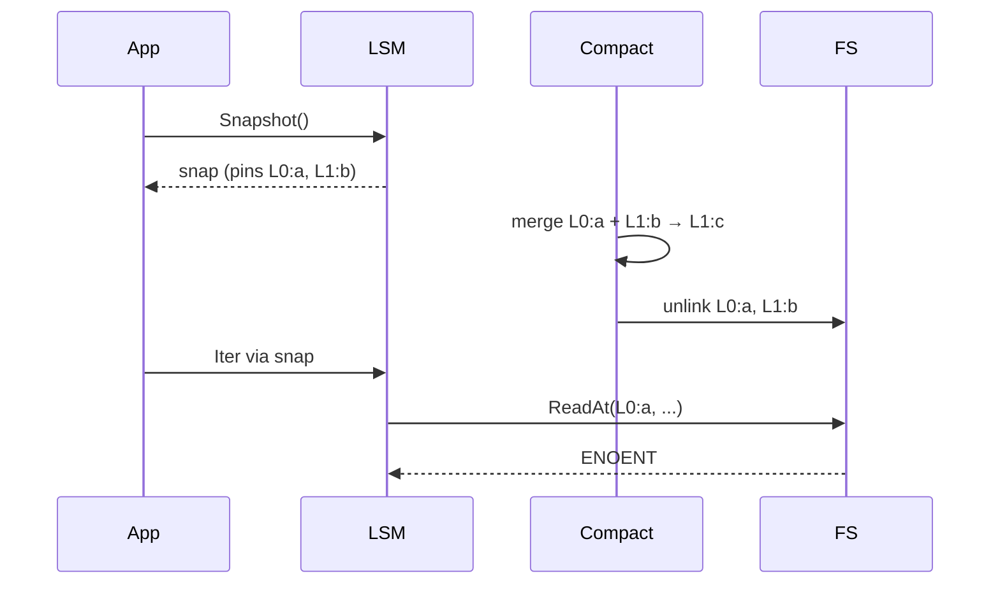
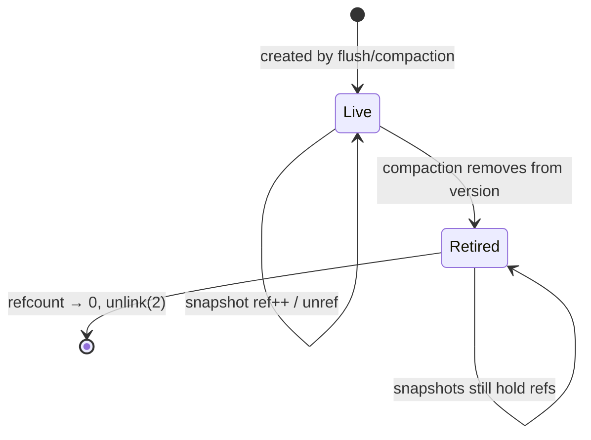

> The trick is not "give me a consistent view" — that's just pinning
> some files. The trick is "don't let compaction delete those files
> while I'm reading them".

A snapshot in an LSM engine is conceptually trivial: capture the set
of "live" SSTables at a moment in time, plus a sequence number, and
filter reads to that snapshot. The hard part is the interaction with
the background compaction worker, which is busy producing new files
and unlinking old ones.

This post is about MiniKV's snapshot lifecycle and the "deferred
deletion" pattern that makes it safe.

## The race



Without coordination, the iterator dereferences a file that compaction
just deleted. The same race exists for point lookups and for any
in-flight read.

## The fix: per-SSTable atomic refcount

Every `SSTable` metadata struct ([`kv/sstable.go`](../kv/sstable.go))
carries an `atomic.Int32` refcount. The rules:

1. **Snapshot creation** holds the LSM read lock, snapshots the live
   SSTable slice, and atomically increments the refcount on each
   pinned file.
2. **Compaction** runs the merge under the write lock long enough to:
   - install the new files into the version (refcount=0 from the
     outside),
   - remove the input files from the version,
   - atomically decrement the input refcounts.
3. **Decrement to zero** is the only place `unlink` is allowed. If
   compaction's decrement takes the count to zero, compaction
   unlinks. If a snapshot's `Close` does, the snapshot unlinks.



A "retired" file is no longer reachable from the live version (so new
reads can never observe it), but it still exists on disk because at
least one snapshot is pinning it.

## Why this is better than "lock the read path"

The naïve alternative is "compaction takes the write lock for the
duration of `unlink`". This works but it serialises compaction
against every in-flight read. With a refcount:

- Reads never block compaction.
- Compaction never blocks reads.
- The only synchronised operation is the metadata swap, which is O(1).

The cost is that disk usage can temporarily exceed steady-state by
the size of all snapshot-pinned files. For long-running snapshots
this is real; the engine exposes per-snapshot age in
[`KV.Stats()`](../kv/stats.go) so an operator can spot a leak.

## The index cache eviction subtlety

There's a second invariant on the same code path. The LSM keeps an
**index cache** keyed by SSTable filename. When compaction retires a
file, the cache entry must be evicted *before* the refcount can
possibly reach zero — otherwise a stale cache entry could be the only
thing keeping the file's index in memory, and a brand-new SSTable
with the same filename (because filenames cycle) could collide.

In MiniKV the order is:

```
1. swap version metadata under write lock
2. evict cache entry for retired SSTable
3. release write lock
4. atomic refcount decrement → maybe unlink
```

The cache eviction has to happen *before* unlink for a different
reason: the cache may hold a `*os.File` handle, and on some
filesystems an `unlink` while a handle is open leaves the file alive
until the handle is closed. That's fine on POSIX, surprising on
Windows.

## Snapshot lifecycle in code

```go
snap, _ := db.Snapshot()        // increments refcount on every live SSTable
defer snap.Close()              // decrements; may trigger deferred unlinks

v, ok, _ := snap.Get(key)       // reads only the pinned set
it, _ := snap.NewIterator(nil, nil)
for it.Next() { ... }
it.Close()
```

A `Snapshot` doesn't pin the MemTable — it captures a sequence number
and filters by it during the read merge. That's why opening a
snapshot is cheap (a couple of atomics) and forgetting to close one
"only" leaks SSTable files, not memory.

## What this design buys you

| Property | Without refcounts | With refcounts |
|---|---|---|
| Compaction blocks reads | yes | no |
| `Snapshot.Get` after compaction | unsafe | safe |
| Disk usage upper bound | steady-state | steady-state + pinned |
| Per-read overhead | mutex | one atomic load |

The pattern generalises beyond LSMs: any system where readers want a
stable view of a mutable set of files (immutable segments, parquet
data lakes, blob-store generations) ends up with some form of
refcount or generation lease. The "atomic int per file" version is
the simplest one that's actually correct.
