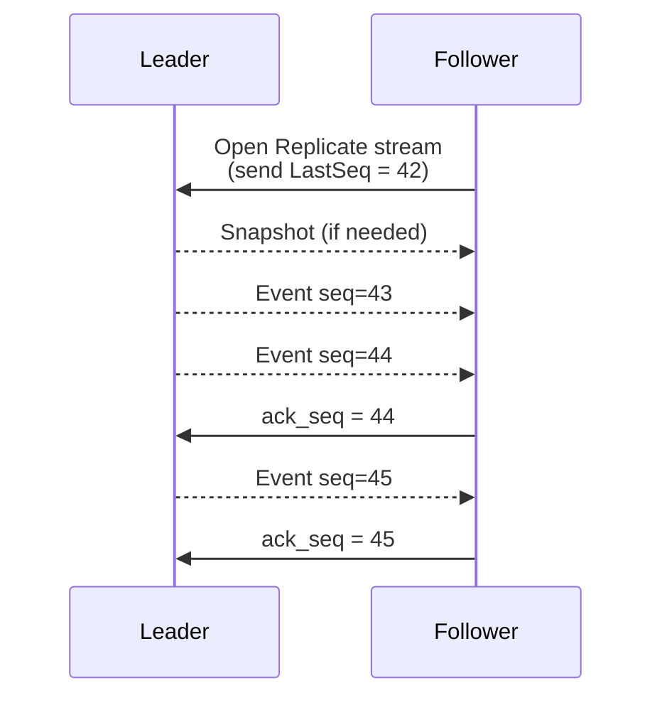
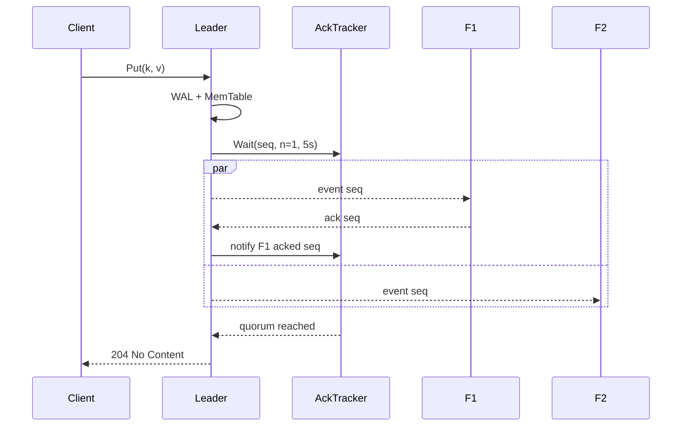

> Two halves of a hard problem: "send every commit to every
> follower" and "tell the leader when it's safe to ack". The second
> half is what makes you reach for a bidirectional stream.

MiniKV's replication ([`kv/grpcapi/`](../kv/grpcapi/),
[`kv/acktracker.go`](../kv/acktracker.go)) is primary-backup. The
leader streams every commit to followers; followers apply each event
and stream `ack_seq` frames back. This post is the design tour.

## The stream



A few non-obvious choices:

1. **The follower opens the stream**, not the leader. This makes NAT
   and ACLs much simpler: only the leader needs an inbound rule.
2. **The follower sends its `LastSeq` first**. The leader decides:
   "are you close enough to catch up from the in-memory log? or do you
   need a fresh snapshot bootstrap?"
3. **`ack_seq` is monotonic.** Followers send acks at their own pace;
   the leader treats them as "I have durably applied everything ≤
   this seq".

## Bootstrap or tail?

When the leader receives the follower's `LastSeq`, it decides:

```go
if followerLastSeq + maxLagWindow < leaderLastSeq {
    // too far behind: send a snapshot, then tail from the snapshot's seq
    sendSnapshot()
}
// then tail every new commit
```

The snapshot is the same `KV.Snapshot()` machinery used for local
consistent reads (see the [snapshot post](05-snapshot-refcounts.md)).
The follower receives a stream of `(key, value, expireAt)` triples,
applies them via `KV.ApplyReplica`, and then transitions into tail
mode at the snapshot's seq.

A clean bootstrap means a follower can join a long-running cluster
without replaying years of WAL.

## Why bidirectional?

Async replication is fundamentally "fire and forget". The leader does
not need acks for *correctness*. But the system grows two reasons
to want them anyway:

### Reason 1: synchronous quorum mode

`Config.SyncReplicas == N` (`N > 0`) blocks a write until `N`
followers have acked it. The implementation lives in
[`kv/acktracker.go`](../kv/acktracker.go):

```go
type AckTracker struct {
    mu       sync.Mutex
    perPeer  map[string]uint64       // peer → highest acked seq
    waiters  map[uint64][]chan error // seq → waiters
}
```

A `Wait(seq, n, timeout)` blocks until at least `n` peers have acked
≥ `seq`, or the timeout fires (then `ErrReplicationTimeout`). The
write is still durable locally regardless of the timeout; the timeout
just gates the *ack to the client*.



### Reason 2: backpressure

Without acks, a slow follower forces the leader to either buffer
unbounded or drop writes. With acks, the leader can decide: "this
follower is N seqs behind; back off the stream or switch them to
re-bootstrap from a snapshot".

MiniKV's implementation is on the simple end — no flow control beyond
"keep one event in flight at a time per peer" — but the channel for
backpressure is already there.

## The HTTP variant exists, but it's async-only

There's also an NDJSON endpoint at `/v1/replicate/stream`
([`kv/httpapi/`](../kv/httpapi/)). It is one-way: leader streams,
client consumes. There is no place to put an ack frame in a
streaming HTTP response without inventing a second request, and at
that point you've reinvented bidi gRPC.

So the rule is: HTTP NDJSON for "I want to tail" or for ops tooling;
gRPC for actual replication. Sync replication *requires* gRPC.

## Resume after restart

Followers persist their `LastSeq` to local storage (the engine's own
WAL covers this for free — applied events go through the same path
as local writes). On restart:

```
1. open local KV → recover LastSeq from WAL
2. open gRPC stream to leader with that LastSeq
3. either tail or bootstrap, as before
```

A reconnect is just another fresh connection. The leader doesn't
keep per-follower state in memory beyond "what's their latest ack"
in the AckTracker.

## What could go wrong

- **Leader crash with un-acked writes**: those writes are durable
  locally but never made it to any follower. Async by design. If you
  can't tolerate this, use sync mode or use raft.
- **Network partition during sync wait**: `ErrReplicationTimeout`
  fires. The write is still on disk; a future reconnect catches the
  follower up.
- **Follower applies out of order**: it can't — the stream is
  ordered per-leader and the follower applies in receive order.
- **Two leaders (split brain)**: this layer doesn't prevent it. The
  operator is supposed to pick exactly one leader. If you want
  automatic prevention, that's what
  [the raft layer](08-master-slave-to-raft.md) is for.

## What this design is good for

Primary-backup async replication is the right tool when:

- You have one obvious "writer" (a single region, a single primary).
- Read replicas are for read scaling or DR, not for write
  availability.
- You can tolerate a small RPO (recovery-point objective) on leader
  failure.

When you need automatic failover and RPO=0, raft is the next stop.
