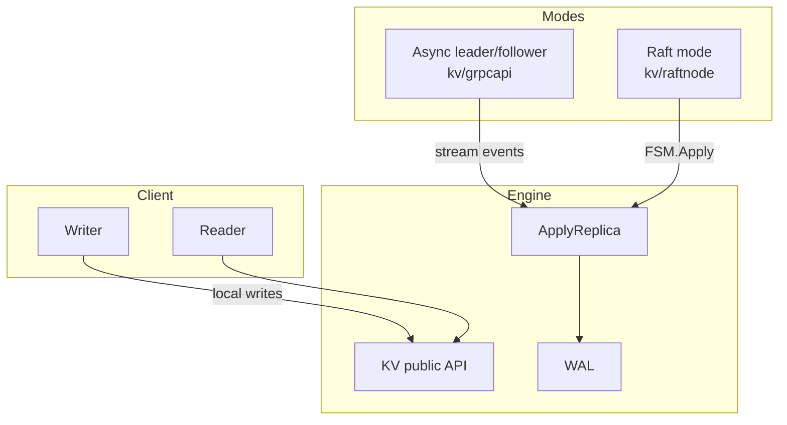

> The lazy move is to delete the async-replication code once raft
> works. The right move is to keep both, because they solve different
> problems.

When MiniKV grew a raft mode, the obvious refactor was: rip out the
old leader/follower path, FSM-ify the KV, done. We deliberately
didn't do that. This post is about why two replication paths coexist
and how they share code.

## The two problems

| Problem | Best tool |
|---|---|
| **Automatic leader election, RPO=0 writes** | Raft |
| **Cross-region read replicas, geo-bootstrap, "broadcast" workloads** | Async master-slave |

Raft is a heavy hammer for cross-region: every commit needs a
round-trip to a quorum. If your secondary is on the other side of an
ocean you're paying that round-trip on every write. Async replication
is a light hammer for HA: a leader failure loses recent un-streamed
writes.

The two are *complementary*, not substitutes.

## The shared layer: `KV.ApplyReplica`

Both paths apply incoming events through the same function:

```go
// kv/replication.go
func (db *KV) ApplyReplica(seq uint64, ev Event) error { ... }
```

Async path: gRPC `Replicate` stream → `ApplyReplica` per event.
Raft path: `FSM.Apply` decodes a `Command` and calls into KV.

This is the seam that makes both modes possible without duplicating
the write path's correctness logic (WAL, memtable, durability).

## Architecture overview



`KV` doesn't know which mode is in front of it. Async and raft
modules know which KV they wrap. The CLI (`cmd/cli.go`) picks one at
startup based on flags.

## Where they diverge

| Concern | Async | Raft |
|---|---|---|
| Who is leader? | Operator picks | Raft elects |
| What happens on leader crash? | Manual failover; possible RPO > 0 | Auto-elect, RPO = 0 (modulo fsync) |
| What's "applied"? | Whatever the follower's local WAL durable seq is | Whatever raft has committed and applied |
| Membership change | Edit config and restart | Online (`AddVoter`, `RemoveServer`) |
| Topology | One leader, N followers | Quorum (typically 3 or 5 voters) + N learners |
| Bidi protocol | gRPC stream | hashicorp/raft TCP transport |

## What the raft path adds

[`kv/raftnode/`](../kv/raftnode/) is small:

- `command.go` — wire format for a single log entry.
- `fsm.go` — `raft.FSM` implementation backed by `*kv.KV`.
- `node.go` — friendly wrapper exposing `Put`, `Get`, `Delete`,
  `LinearizableGet`, `AddVoter`, etc.
- `http.go` — control plane HTTP handlers (status, peers, join,
  transfer, peer_announce) plus follower→leader proxy.

The FSM is the cleanest part. `Apply` is a switch over opcodes:

```go
case OpPut:    db.Put(cmd.Key, cmd.Value)            // or PutWithTTL
case OpDelete: db.Delete(cmd.Key)
case OpSetPeer: f.peers[cmd.Key] = cmd.Value          // control-plane
```

Everything else — log replication, leader election, snapshots,
membership — is hashicorp/raft.

## The "linearizable read" question

In the async path, "read your write" works only if you read from the
leader. In the raft path, reads are still local by default (and
therefore stale by up to one applied entry), and there's an opt-in
`LinearizableGet(key, timeout)`:

```go
// kv/raftnode/node.go
func (n *Node) LinearizableGet(key []byte, timeout time.Duration) ([]byte, bool, error) {
    if !n.IsLeader() { return nil, false, ErrNotLeader }
    if err := n.raft.Barrier(timeout).Error(); err != nil { ... }
    return n.fsm.DB().Get(key)
}
```

`raft.Barrier` proposes a no-op and waits for it to commit, ensuring
the FSM has applied every prior write. After the barrier, a local
read on the leader is linearizable.

This is the "do nothing fancy" approach. There are clever leader-lease
schemes that avoid the barrier round-trip for hot reads; we don't
need them yet.

## What we kept that we could have deleted

- **The whole `kv/grpcapi/Replicate` path.** Still used by anyone
  wanting cheap async replication.
- **`SyncReplicas` quorum mode.** Still useful when raft is overkill
  but RPO=0 is required for a particular write.
- **The HTTP NDJSON replicate stream.** Pure ops tool, harmless to
  keep.

The cost of keeping them is a couple of extra packages and one
config knob. The benefit is that MiniKV can sit in roles where raft
would be the wrong tool.

## Take-away

When you add a new mechanism that *could* replace an old one, the
question to ask is not "are they redundant?" but "do they solve the
same problem under the same constraints?". For replication, almost
never.
