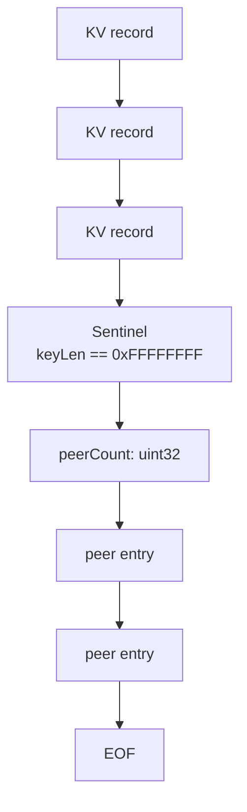

> The snapshot stream is "just" a sequence of KV records. Now I want
> to put some extra metadata in it without breaking the existing
> decoder. The cheap, ugly, correct answer is a sentinel.

When MiniKV's raft mode learned to replicate peer HTTP addresses (see
[the replicated peer map post](11-replicated-peer-map.md)), the
question became: *where do those peer addresses live in the FSM
snapshot?* They aren't real KV keys, but they have to survive
`Snapshot → Persist → Restore`.

This post is about the format I landed on and the reasoning that got
me there.

## The starting format

The original snapshot stream was a flat sequence of KV records:

```
+--------+-----+--------+-------+----------+
| keyLen | key | valLen | value | expireAt |  ← one record
+--------+-----+--------+-------+----------+
| keyLen | key | valLen | value | expireAt |
...
EOF
```

`keyLen` and `valLen` are `uint32` big-endian; `expireAt` is `int64`
big-endian (0 = no TTL). The full code is the
[`fsmSnapshot.Persist`](../kv/raftnode/fsm.go#L256) function.

Decoding is the inverse: read until EOF, one record at a time.

## The new requirement

After the snapshot's KV records, we want to write a peer map:

```
nodeID → HTTP advertise addr
```

There can be zero, one, or many of these. They are metadata, not
user data, so they shouldn't be confused with real KV records on
restore.

Three options came to mind:

1. **Length prefix at the start of the stream.** "Here are M peers,
   then N records." Clean, but breaks every old reader. Existing
   on-disk snapshots become unreadable. Bumped format version.
2. **TLV envelope around everything.** Every section gets a type tag
   and a length. Cleanest long-term, but requires reworking the
   record format too.
3. **Sentinel marker between sections.** A magic `keyLen` value that
   can't occur in real data, followed by the new section. Old
   snapshots (no peer block) just hit EOF where the sentinel would be
   and decode normally. New snapshots add the sentinel only when
   there's something to put after it.

Option 3 is what shipped.

## The format



A peer entry is:

```
+-------+----+----------+------+
| idLen | id | addrLen  | addr |
+-------+----+----------+------+
```

The sentinel is `0xFFFFFFFF`, which would otherwise mean "a key 4
GiB long" — impossible in practice. The constant is named
`peerBlockSentinel` in [`kv/raftnode/fsm.go`](../kv/raftnode/fsm.go).

## The decoder

The decoder reads the next `uint32` as `keyLen`. If it equals the
sentinel, switch into peer-block mode and stop after consuming the
declared peers. Otherwise, treat it as a key length and continue
parsing the record.

```go
// kv/raftnode/fsm.go (simplified)
recordLoop:
for {
    if _, err := io.ReadFull(r, hdr[:4]); err != nil {
        if errors.Is(err, io.EOF) { break }
        return err
    }
    keyLen := binary.BigEndian.Uint32(hdr[:4])
    if keyLen == peerBlockSentinel {
        // ... read peerCount, then peerCount entries ...
        break recordLoop
    }
    // ... normal record parse ...
}
```

The `break recordLoop` says "the peer block is the last thing in the
stream". If we ever need a third section, we'd add another sentinel
and another `break`.

## Compatibility properties

- **Old snapshot, new reader**: there's no sentinel, so the decoder
  hits EOF after the last KV record and exits normally. Works.
- **New snapshot, old reader**: the old reader hits the sentinel,
  interprets it as `keyLen = 4 GiB`, and tries to allocate a key
  buffer. Fails loudly. *Not* backward compatible. We didn't need
  this direction.
- **New snapshot, new reader, no peers**: `Persist` skips the peer
  block entirely (`if len(s.peers) > 0`). The stream is byte-identical
  to the old format. Old readers can still read these.

That last property is what makes the choice defensible: rollouts
where no peers have been announced yet produce snapshots that work
with both versions.

## What this is *not*

It is not a clean extensible format. The first sentinel-extension
was free; the second would force a real envelope. If you anticipate
more than one metadata block, just go to TLV from the start.

It is, however, the smallest correct change to add one piece of
metadata to an existing flat stream. That's the niche.

## Testing

Both ends of the format are exercised by the
[`TestFSMSnapshotRestoreRoundTrip`](../kv/raftnode/fsm_test.go)
test:

1. Build a fresh FSM, `Apply` some KV writes and `OpSetPeer`
   commands.
2. Take a snapshot, persist into a `bytes.Buffer` via a fake
   `raft.SnapshotSink`.
3. Open a fresh FSM at a new data dir, `Restore` from the buffer.
4. Assert KV state, TTL, and the peer map all match.

Plus `TestFSMRestoreExpiredTTLIsSkipped` mutates the `ExpireAt` bytes
in the persisted buffer to a past timestamp and verifies the expired
record is dropped on restore — testing the record-level part of the
format independent of the peer block.

## Take-away

When you need to extend a flat stream format that already has
consumers, "sentinel + new section" is the smallest viable trick.
Pick a value that can't occur in real data, document it as a
constant, and don't reach for it more than once.
