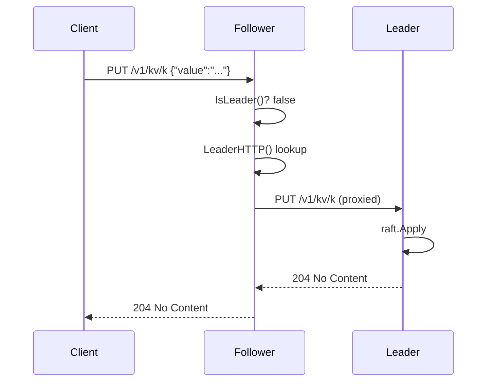

> When a write arrives on a non-leader, you have two choices: send
> the client a redirect, or silently forward. Forwarding is friendlier
> but has more sharp edges. Here's how MiniKV does it in 30 lines.

In a raft cluster only the leader may accept writes. The naïve API is:
"if you hit a follower, get back a 503 with a hint and retry against
the leader". That works but pushes complexity onto every client.

The friendlier API: the follower itself forwards the request to the
leader and streams the response back. From the client's perspective
there is no leader concept at all.

## The flow



The follower is just a reverse proxy. The leader does the actual
work. The client sees one round-trip and one response — no retry, no
redirect.

## Why is this hard?

Three sharp edges:

1. **The follower doesn't know the leader's HTTP address natively.**
   Raft's `Leader()` returns the leader's *raft transport* address
   (`127.0.0.1:7001`), not its HTTP address (`127.0.0.1:8081`). They
   are typically different ports.
2. **During an election there is no leader at all.**
3. **A reverse proxy hop must not silently retry on connection
   reset.** If the leader crashes mid-request, the client must see a
   real error.

MiniKV's solution to (1) is a separate post:
[the replicated peer-HTTP map](11-replicated-peer-map.md). With that
machinery in place, the proxy itself is small.

## The 30-line proxy

The whole forwarder, from [`kv/raftnode/http.go`](../kv/raftnode/http.go):

```go
func proxyToLeader(w http.ResponseWriter, r *http.Request, node *Node) bool {
    leaderHTTP := node.LeaderHTTP()
    if leaderHTTP == "" {
        return false
    }
    target, err := url.Parse(normalizeHTTPURL(leaderHTTP))
    if err != nil {
        return false
    }
    proxy := httputil.NewSingleHostReverseProxy(target)
    proxy.ErrorHandler = func(w http.ResponseWriter, _ *http.Request, err error) {
        http.Error(w, "leader forward failed: "+err.Error(), http.StatusBadGateway)
    }
    r.Header.Set("X-MiniKV-Forwarded", "1")
    proxy.ServeHTTP(w, r)
    return true
}
```

And the call site:

```go
case http.MethodPut:
    if !node.IsLeader() {
        if proxyToLeader(w, r, node) {
            return                          // forwarded; response written
        }
        writeRaftErr(w, node, ErrNotLeader) // no leader HTTP known → 503
        return
    }
    // ... handle as leader ...
```

That's it. The actual proxying is `httputil.NewSingleHostReverseProxy`
out of the box. The "interesting" parts are the three small policy
decisions around it.

## Decision 1: when to fall back to 503

If `LeaderHTTP()` returns `""` — no leader is currently known, or the
peer map hasn't been populated — `proxyToLeader` returns `false` and
the handler falls through to `writeRaftErr`, which produces:

```
HTTP/1.1 503 Service Unavailable
X-Leader: 127.0.0.1:7001        ← raft transport addr, if known
X-Leader-HTTP: 127.0.0.1:8081   ← HTTP addr, if known
```

Clients that *want* to retry-with-hint can read those headers.
Clients that just want a working API try again in a few hundred
milliseconds (a raft election finishes in roughly that time).

## Decision 2: never retry inside the proxy

`httputil.NewSingleHostReverseProxy` has a built-in `ErrorHandler`
that, by default, would write a 502 with a generic message. We
override it to keep the message short but still produce 502. We do
*not* attempt to re-resolve the leader and re-send: if the leader
crashed mid-request, the client should learn about it, not silently
get retried against the new leader (whose state may already differ).

## Decision 3: tag the hop

`r.Header.Set("X-MiniKV-Forwarded", "1")` marks the request so a
future "two follower hops" situation can be detected. We don't act
on it today — we just never forward an already-forwarded request —
but the marker is there.

## The URL-normalisation tax

The `peers` map stores HTTP advertise addresses as the operator typed
them, which may be:

- `":8081"` — bind on all interfaces, no host
- `"127.0.0.1:8081"` — bare `host:port`
- `"http://10.0.0.5:8081"` — already a full URL

`url.Parse` needs the last form. `normalizeHTTPURL` (also in
`http.go`) coerces:

```go
func normalizeHTTPURL(s string) string {
    if strings.HasPrefix(s, "http://") || strings.HasPrefix(s, "https://") { return s }
    if strings.HasPrefix(s, ":") { return "http://127.0.0.1" + s }
    return "http://" + s
}
```

A small piece of "where ops convenience meets URL strictness" glue.

## What the tests prove

[`TestHTTPForwardingProxiesNonLeaderWrites`](../kv/raftnode/http_test.go)
spins up a 3-node cluster behind `httptest` servers, announces every
node's HTTP address through the leader, then PUTs against a
*follower* and asserts:

- the response is 204 No Content (not 503),
- the value is readable from every node.

The complementary test, `TestHTTPNoForwardingWithoutAnnounce`, omits
the announce step and asserts the follower returns 503 with an
`X-Leader` header. That's the "the system fails clearly when
configured wrong" half of the contract.

## When you should *not* do this

Forwarding hides the cluster from the client. That's the point. It's
also a downside in some cases:

- **High-throughput writes**: every write now pays an extra
  intra-cluster RTT. A leader-aware client (raft-style "client knows
  the leader and reconnects on `ErrNotLeader`") is faster.
- **TLS / auth complexity**: the follower has to be authorised to
  call the leader. Internal mesh is fine; mixed-trust is not.

For an embedded engine or a small cluster, the simplicity wins. For
a high-RPS production database, expose the cluster topology and let
clients do their own routing.
