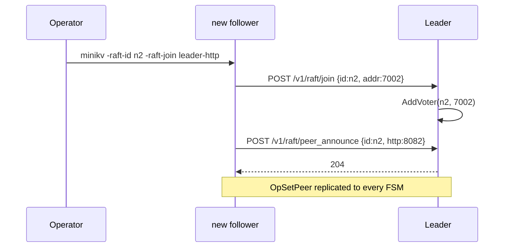

> Raft replicates "data". MiniKV uses it to also replicate "where to
> reach me". The blast radius of putting control-plane state into the
> data-plane log is smaller than you'd think.

When a follower wants to forward a write to the leader (see
[the forwarding post](10-follower-leader-proxy.md)), it needs the
leader's HTTP address. Raft will happily tell it the leader's *raft
transport* address (`127.0.0.1:7001`), but that's not where the HTTP
API lives (`127.0.0.1:8081`).

How do you make the HTTP-address map available on every node, kept
in sync as nodes join, leave, or restart, and survive snapshot/
restore?

The answer MiniKV landed on: **put it in the raft log**.

## The mechanism

A new opcode in [`kv/raftnode/command.go`](../kv/raftnode/command.go):

```go
const (
    OpPut     Op = 1
    OpDelete  Op = 2
    OpSetPeer Op = 3   // Key = NodeID, Value = HTTP advertise addr
)
```

`OpSetPeer` is applied by the FSM ([`fsm.go`](../kv/raftnode/fsm.go))
into a `map[string]string` stored alongside the KV:

```go
case OpSetPeer:
    f.mu.Lock()
    if len(cmd.Value) == 0 {
        delete(f.peers, string(cmd.Key))   // empty value = remove
    } else {
        f.peers[string(cmd.Key)] = string(cmd.Value)
    }
    f.mu.Unlock()
```

Every node applies every `OpSetPeer` in commit order. The map is the
same on every node, by construction.

## The HTTP endpoint

`POST /v1/raft/peer_announce {"id":"n2","http":"127.0.0.1:8082"}` is
leader-only. The handler proposes an `OpSetPeer` through raft. Once
committed, every FSM (including followers) has the new entry.

## When does it run?



There's also a **self-announce loop** in [`cmd/raft.go`](../cmd/raft.go)
that re-announces the local HTTP address whenever the node observes
itself becoming leader and its own entry in the peer map is stale.
This handles the case where the previous leader crashed before
announcing the newly-joined follower.

## Why not store it outside raft?

The alternatives I considered:

### Option A: gossip

A side-channel gossip protocol (memberlist, SWIM, …) maintains the
peer map.

- **Pro:** zero coupling with raft.
- **Con:** another protocol on the wire, another set of failure
  modes, eventual consistency between the peer map and raft
  membership.

For a 3-7 node single-region cluster this is overkill.

### Option B: each node re-announces on every heartbeat over HTTP

- **Pro:** dead simple.
- **Con:** O(N²) writes per heartbeat tick; also doesn't survive
  network partition cleanly (a node that *is* a member but
  temporarily can't reach the leader's HTTP would seem to disappear
  from the map).

### Option C: derive HTTP port from raft port by convention

E.g. `http_port = raft_port + 1000`.

- **Pro:** zero state.
- **Con:** breaks the moment one operator deploys with non-default
  port layout. We've all been there.

### Option D (chosen): put it in the raft log

- **Pro:** single source of truth, automatic replication, survives
  snapshot via the [sentinel format](09-raft-fsm-snapshot-sentinel.md),
  consistent with raft's view of membership.
- **Con:** raft now carries a tiny bit of "control plane" data. As
  long as the data is small and rare, the cost is real but negligible.

## Cost analysis

How often does `OpSetPeer` actually run?

- Once per node, on join.
- Once when a node becomes leader and discovers its own announcement
  is missing (self-announce loop). Rare.
- Manually, if an operator changes a node's HTTP advertise address.

A small cluster sees a handful of these total. The raft log is
already accepting thousands of `OpPut`/`OpDelete` per second; a few
control entries don't move the needle.

## Snapshot integration

When the FSM takes a snapshot, the peer map has to go along —
otherwise a restored node would lose every peer it learned. The
serialised format is described in
[the snapshot post](09-raft-fsm-snapshot-sentinel.md): a sentinel
keyLen `0xFFFFFFFF` introduces the peer block, followed by
`peerCount` and per-peer `(idLen, id, addrLen, addr)`.

On restore, the peer map is rebuilt from the snapshot before raft
hands the FSM live `Apply` calls. So a restored node is immediately
useful as both a voter and a proxy target.

## Operator-visible surface

```
GET  /v1/raft/peers          → {"n1":"127.0.0.1:8081", "n2":"...", ...}
POST /v1/raft/peer_announce  → leader-only; proposes OpSetPeer
GET  /v1/raft/status         → includes local node's http for status pages
```

For debugging a misbehaving cluster, `curl /v1/raft/peers` on every
node should return the same map. If they differ, raft is partitioned
or a node hasn't caught up.

## The general lesson

It is OK to put a tiny amount of control-plane data into your
data-plane consensus log if:

- The data is naturally consistent with raft's view (here: per-node
  HTTP address is consistent with raft membership).
- The write rate is negligible compared to user data.
- The alternative is a second consistency mechanism running alongside
  raft.

Don't put rapidly-changing operational state (health checks,
latencies) into the raft log. *Do* put rarely-changing "where to find
me" state. The peer map is comfortably on the "do" side.
