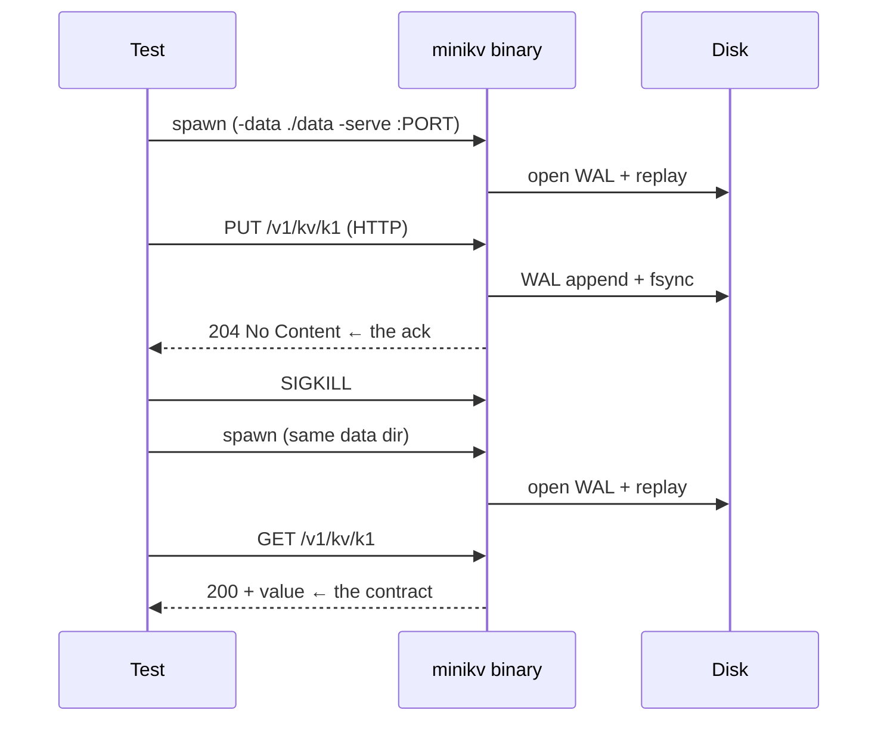

> Unit tests can't tell you if your WAL survives a power loss. Only
> killing the process and restarting it can. Here is how to make that
> test small enough to run on every commit.

If there's one test that justifies its own existence in a storage
engine, it's "ack a write, kill the process with `SIGKILL`, restart,
read the write back". Everything else — replication, transactions,
TTL — is layered on top of that one promise.

MiniKV's version of that test is
[`tests/faultinject_test.go`](../tests/faultinject_test.go). This
post is about how it's structured and why each piece is the way it
is.

## The shape



Four things matter:

1. **Spawn the real binary.** Not the in-process library. A `*kv.KV`
   inside the test process can't be killed mid-fsync without taking
   the test runner with it. The real binary as a subprocess can.
2. **Drive over HTTP.** Generic, ack-bearing, easy to time.
3. **`SIGKILL`, not `SIGTERM`.** `SIGTERM` invites a graceful
   shutdown that may finish in-flight work. `SIGKILL` is the test.
4. **The contract is per-acked write.** Anything that returned
   204 must be readable post-restart. Anything still in flight when
   the signal arrived may or may not survive — that's correct
   behaviour, not a bug.

## The runner

```go
// tests/faultinject_test.go (sketch)
func TestSIGKILLRecovery(t *testing.T) {
    dir := t.TempDir()
    bin := buildMiniKVOnce(t)

    cmd := exec.Command(bin, "-data", dir, "-serve", ":0", "-sync", "always")
    stdout, _ := cmd.StdoutPipe()
    require.NoError(t, cmd.Start())

    port := readPortFromStdout(stdout)
    client := httpClient(port)

    // ... PUT a bunch of keys, collect (key, value) pairs where the
    // response was 204 ...

    require.NoError(t, cmd.Process.Signal(syscall.SIGKILL))
    cmd.Wait()

    // restart
    cmd2 := exec.Command(bin, "-data", dir, "-serve", ":0")
    ...
    for _, kv := range acked {
        got, ok := client2.Get(kv.K)
        require.True(t, ok, "lost ack'd write %q", kv.K)
        require.Equal(t, kv.V, got)
    }
}
```

A few details:

- `t.TempDir()` cleans up after the test, including post-`SIGKILL`
  leftover files.
- `-serve :0` asks for a kernel-assigned port; the test reads the
  chosen port from the server's first log line.
- `buildMiniKVOnce` uses `sync.Once` so multiple tests in the same
  run share one `go build`.

## Concurrent multi-writer variant

The single-writer version proves "the WAL is durable". The harder
version is:

> While ten goroutines hammer PUTs concurrently, SIGKILL at a random
> moment. After restart, every response that was 204 must be
> readable.

This catches a class of bugs the single-writer test doesn't: lock-
ordering issues that only manifest when fsync happens for batch A
while batch B is still in the MemTable. MiniKV's test runs this with
N writers and asserts the same per-ack contract.

## The "ack means durable" definition

The ack contract is precise:

> A 204 No Content from the HTTP server means the WAL has been
> appended *and fsynced* with this write's record, *before* the
> response was written to the socket.

If anything in the stack relaxes that — a write returning before
fsync, a buffered HTTP writer flushing late, a "wait for replication"
that races with the WAL — the test catches it. That's why the test
is a much stronger statement than "the engine reads what it writes
in steady state".

## Why HTTP, not the Go API

The Go API (`kv.KV.Put`) is a function call. You can't `SIGKILL` a
function call. You can `os.Exit` the test, but then you lose the
test runner's ability to verify anything.

HTTP is process-to-process. Killing the server is one syscall. The
test process keeps running and gets to do the assertions.

It also tests the surface a real user touches, which is the right
unit of "did I keep my promise?".

## What this test does *not* cover

- **Filesystem reorderings.** A real power loss can reorder writes
  that fsync hasn't covered. The test doesn't simulate that; it just
  trusts the OS fsync semantics. For a real engine targeting consumer
  hardware, [ALICE](https://research.cs.wisc.edu/adsl/Publications/alice-osdi14.pdf)
  or similar is the next step.
- **Disk corruption.** Bit flips inside WAL records would still
  pass CRC32C and corrupt the MemTable on replay. We don't fault-
  inject torn writes inside records, only between them.
- **Replication.** This is a single-node durability test. The raft
  failover test is a separate concern.

For an MVP storage engine, the SIGKILL test is the floor. Without it,
no test result means anything. With it, every other test gets to
assume the durability layer holds.

## Running it

```bash
go test -race -count=1 ./tests -run TestSIGKILL -v -timeout 120s
```

The race flag matters: most engine bugs that *only* show under crash
are bugs in the same write path that the race detector would flag in
steady state.
