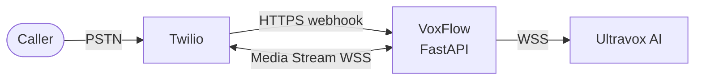

*End-to-end tutorial using Twilio, Ultravox, and FastAPI*

## What we're building

A phone number that, when called, is answered by an AI agent that can:
- Greet the caller and verify their identity
- Answer questions from a knowledge base
- Schedule meetings on a calendar
- Hand off the transcript to a workflow engine when the call ends

No human in the loop. Real audio, real conversation, real tool calls.

## The three actors



- **Twilio** owns the phone number and the audio pipe.
- **Ultravox** is a hosted speech-to-speech AI (think GPT-4o realtime but multi-vendor).
- **VoxFlow** is the FastAPI middleware that glues them together.

## The call lifecycle

1. **Inbound HTTP** — Twilio POSTs to `/incoming-call` when a call arrives.
2. **TwiML response** — VoxFlow returns XML instructing Twilio to open a WebSocket to `/media-stream`.
3. **Dual WebSockets** — VoxFlow now holds two WebSockets simultaneously: one to Twilio (caller audio in/out) and one to Ultravox (AI audio in/out).
4. **Audio relay** — Bytes flow in both directions with format conversion (μ-law ↔ PCM, see [post 2](02-mulaw-pcm-audio-bridge.md)).
5. **Tool calls** — When the AI decides to call a tool (`schedule_meeting`, `queryCorpus`), VoxFlow validates the params and dispatches.
6. **Cleanup** — When either side closes, the session is popped and the transcript is shipped to n8n.

## Minimum code to receive a call

```python
@router.post("/incoming-call")
async def incoming_call(request: Request) -> Response:
    form = await request.form()
    caller = form.get("From", "Unknown")
    call_sid = form.get("CallSid")

    first_message = await _fetch_first_message_from_n8n(caller)
    join_url = await create_ultravox_call(SYSTEM_PROMPT, first_message)

    await session_manager.create(call_sid, caller_number=caller, ...)

    response = VoiceResponse()
    connect = Connect()
    stream = connect.stream(url=f"{PUBLIC_URL}/media-stream")
    stream.parameter(name="callSid", value=call_sid)
    response.append(connect)
    return Response(content=str(response), media_type="application/xml")
```

Two outbound calls (n8n for the greeting, Ultravox to provision an AI session) followed by a TwiML response. That's the entire handshake.

## What makes this hard

The naive demo is easy. Production is hard because:

- **Two WebSockets, one fail-fast lifecycle** — if either closes you must close the other. See [post 3](03-asyncio-taskgroup-websockets.md) on `asyncio.TaskGroup`.
- **Audio format mismatch** — Twilio sends 8kHz μ-law, Ultravox expects 16-bit PCM. [Post 2](02-mulaw-pcm-audio-bridge.md).
- **LLM tools can hallucinate parameters** — never trust the JSON. [Post 7](07-pydantic-tool-validation.md).
- **One prompt is not enough** — verification, main conversation, and summary need distinct system prompts. [Post 4](04-multi-stage-conversation-state-machine.md).

## What you need to follow along

| Service | Cost to try | Purpose |
|---------|-------------|---------|
| Twilio | Free trial credit | Phone number + audio streaming |
| Ultravox | Free tier | Speech-to-speech AI |
| n8n | Self-host or cloud free | Workflow engine for greetings + transcripts |
| ngrok | Free | Expose your localhost to Twilio webhooks |

Clone the repo, copy `.env.example` to `.env`, fill in the keys, and run:

```bash
uvicorn app.main:app --host 0.0.0.0 --port 8000 --reload
ngrok http 8000  # use the https URL as PUBLIC_URL and Twilio webhook
```

Call your Twilio number. The AI picks up.

## Next reads

- The audio plumbing → [post 2](02-mulaw-pcm-audio-bridge.md)
- The async glue → [post 3](03-asyncio-taskgroup-websockets.md)
- The conversation design → [post 4](04-multi-stage-conversation-state-machine.md)
