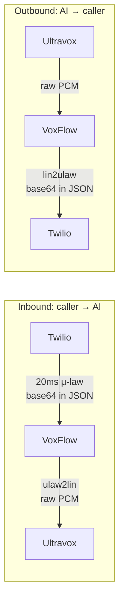

*Why your AI model can't speak directly to a phone, and what you have to do about it.*

## The format mismatch

Two facts that don't go together:

| Side | Format | Sample rate | Why |
|------|--------|-------------|-----|
| Telephone (Twilio) | μ-law (G.711) | 8000 Hz | Decided in the 1970s for the PSTN |
| AI model (Ultravox) | Linear PCM 16-bit | 8000 Hz (configurable) | What ML models actually consume |

If you pipe Twilio's audio bytes straight into Ultravox you get noise. You must transcode every audio frame, in both directions, at the speed of conversation (~20ms chunks).

## What μ-law actually is

μ-law is a **logarithmic compander**. Instead of using 16 bits to represent amplitude linearly (which wastes precision on loud sounds), it uses 8 bits with a logarithmic curve, giving you more resolution where the ear is sensitive.

Result: half the bandwidth, perceptually equivalent quality for speech, terrible for music. Perfect for phones.

## The conversion in code

Python's standard library shipped `audioop` for exactly this purpose:

```python
import audioop

# Twilio → Ultravox (inbound audio)
pcm_bytes = audioop.ulaw2lin(mu_law_bytes, 2)  # 2 = 16-bit width

# Ultravox → Twilio (outbound audio)
mu_law_bytes = audioop.lin2ulaw(pcm_bytes, 2)
```

Two function calls. That's the entire transcoding layer.

## The Python 3.13 problem

`audioop` was **removed** from the standard library in Python 3.13. If you upgrade your runtime, your call handler breaks with `ModuleNotFoundError`.

The fix is a third-party drop-in replacement called `audioop-lts`:

```python
try:
    import audioop  # Python < 3.13
except ModuleNotFoundError:
    import audioop_lts as audioop  # Python 3.13+
```

Same API, same performance (it's the original C code, just packaged separately).

## The data flow



Twilio wraps the μ-law bytes in base64 inside a JSON envelope. Ultravox sends raw binary frames over WebSocket. So the transformation pipeline is:

**Inbound:** JSON parse → base64 decode → `ulaw2lin` → send to Ultravox
**Outbound:** receive from Ultravox → `lin2ulaw` → base64 encode → JSON wrap → send to Twilio

## A common bug: sample width

`audioop.ulaw2lin(data, width)` — the `width` is the **output** width in bytes. Always 2 for 16-bit PCM. Passing 1 silently produces 8-bit PCM that sounds like a fuzz pedal.

## A common bug: assuming the sample rate

Twilio is **always** 8 kHz. Ultravox lets you configure `inputSampleRate` and `outputSampleRate`. They must match Twilio (8000) or you'll need to resample, which `audioop.ratecv` can do but introduces latency.

## Why not just use Opus or PCMU directly?

You can. Twilio supports Opus on outbound only and PCMU is just another name for μ-law. The constraint is what the AI vendor accepts. Ultravox's `serverWebSocket` medium currently expects raw PCM, so transcoding is unavoidable.

## Latency budget

For a natural-feeling conversation, the round trip (you stop speaking → AI starts replying) should be under ~700ms. `audioop` adds <1ms per frame — completely negligible. The latency lives in the network, the model, and the turn-detection delay (Ultravox's `turnEndpointDelay`, default 384ms in VoxFlow).

## Takeaway

The audio bridge is two lines of code, but understanding *why* those two lines matter is the difference between "it works" and "I can debug it when it doesn't."
