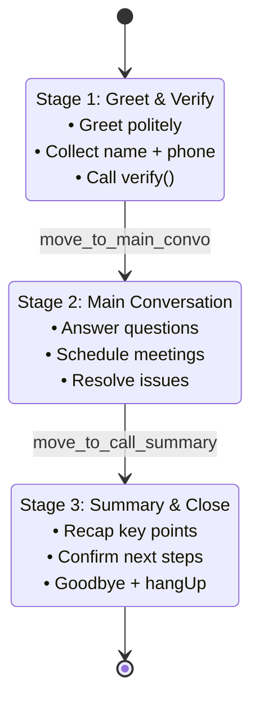

*Why a single system prompt is never enough, and how to use tool calls as state transitions.*

## The temptation: one giant prompt

The first instinct when building a conversational AI is to cram everything into one system prompt:

```
You are Sara, a receptionist. First greet the user, then verify their identity,
then answer their questions, then schedule a meeting if needed, then summarize
the call and say goodbye.
```

This works for two turns and falls apart for ten. The model loses track of which "stage" it's in, repeats itself, skips verification, ends the call early. Token budget bloats. Behavior is non-deterministic.

## The pattern: prompts as states

Treat each conversational phase as a state with its own system prompt:



Each stage gets:
- Its **own focused prompt** (200 lines instead of 600)
- **Strict transition criteria** (e.g., "ONLY proceed if verification = Confirmed")
- A **dedicated tool** to trigger the next state (`move_to_main_convo`, `move_to_call_summary`)

## How transitions happen

The AI doesn't change state on its own. It calls a tool. The tool handler is what actually swaps the system prompt:

```python
async def handle_move_to_main_convo(uv_ws, invocation_id, params):
    prompt = get_stage_prompt('main_convo')
    voice = get_stage_voice('main_convo')
    await uv_ws.send(json.dumps({
        "type": "stage_transition",
        "newSystemPrompt": prompt,
        "newVoice": voice,
    }))
    await _send_tool_result(uv_ws, invocation_id, "Transitioned")
```

The AI's "intent to transition" becomes a discrete event that code can validate, log, gate on business rules, or refuse.

## Why this is better than memory tricks

Alternatives like "summarize the conversation so far and re-inject it" or "use chain-of-thought to remember which step you're on" are workarounds for not having explicit state. They fail in long calls.

Explicit state gives you:

| Property | Benefit |
|----------|---------|
| Smaller per-stage prompts | Lower latency, lower cost, fewer instructions for the model to ignore |
| Programmatic gating | "Don't transition to summary unless `verified=True`" — enforced in code, not by polite asking |
| Per-stage voice/persona | Maybe verification uses a different voice than the friendly main convo |
| Audit trail | Every transition is a logged event with caller, timestamp, reason |
| A/B testing | Swap one stage's prompt without touching the others |

## The hidden bug to avoid

A common mistake when building stage prompts: putting `{now}` (current timestamp) in an f-string at module import time.

```python
# WRONG — now is frozen when Python imports the module
now = datetime.utcnow().strftime("%Y-%m-%d %H:%M:%S")
SYSTEM_PROMPT = f"Current time: {now}. You are an AI assistant..."
```

Three months later your AI is still telling callers it's January. The fix is to use template strings and substitute at call time:

```python
# RIGHT
_SYSTEM_TEMPLATE = "Current time: {now}. You are an AI assistant..."

def get_system_prompt() -> str:
    now = datetime.datetime.now(datetime.UTC).strftime("%Y-%m-%d %H:%M:%S")
    return _SYSTEM_TEMPLATE.format(now=now)
```

## Designing the stages

Three questions for each stage:

1. **Entry condition** — what must be true before we enter this stage?
2. **Exit condition** — what must be true before we leave?
3. **Allowed tools** — which functions can the model call here?

For VoxFlow's greeting stage:
- Entry: call connected
- Exit: `verify` returned `Confirmed` AND caller stated intent
- Tools: `verify`, `move_to_main_convo`, `hangUp`

For the main convo stage:
- Entry: previous stage transitioned via `move_to_main_convo`
- Exit: customer indicates satisfaction
- Tools: `queryCorpus`, `schedule_meeting`, `move_to_call_summary`, `hangUp`

Writing these criteria *first* makes the prompt almost write itself.

## Takeaway

Multi-stage conversation = multi-prompt + tool-triggered transitions. It's a state machine the LLM happens to drive. Code stays in charge of the transitions; the LLM stays in charge of the conversation.
