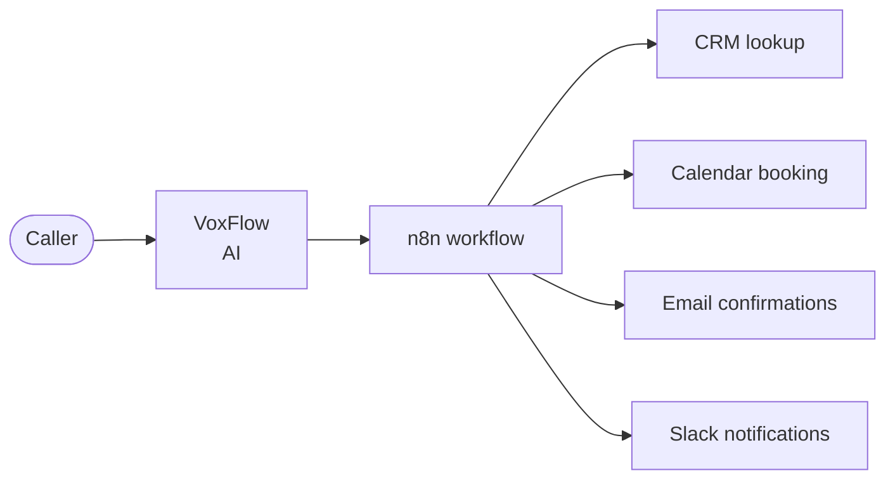
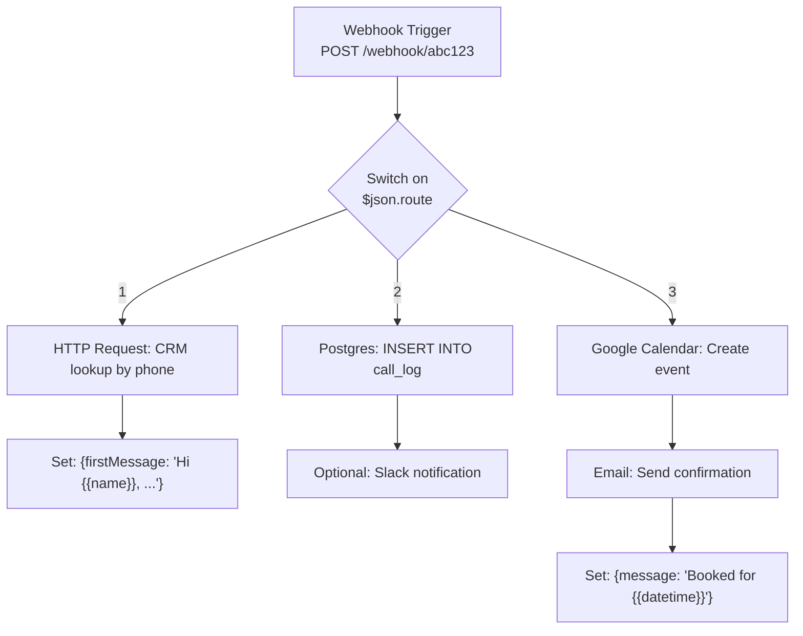
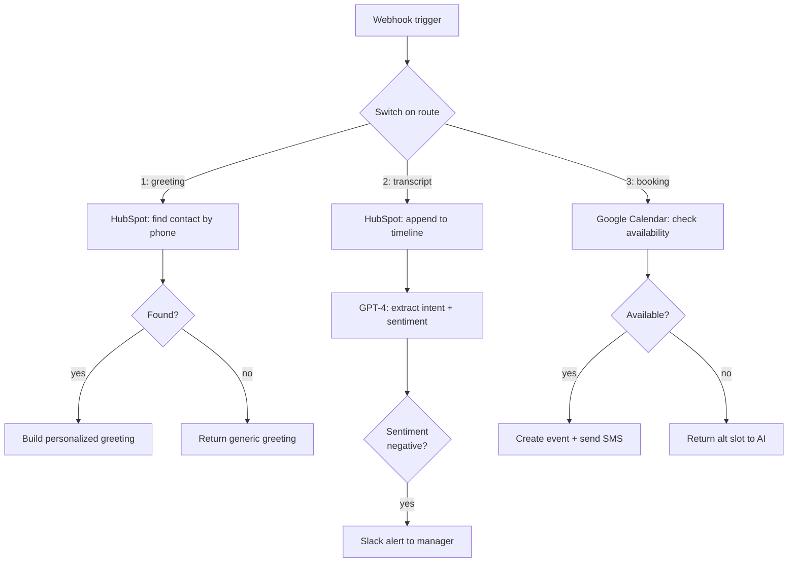

*Use VoxFlow as the AI brain, n8n as the business logic.*

## The separation of concerns

VoxFlow does one thing: it makes a phone call into an AI conversation. It doesn't know about your CRM, your calendar, your email templates, or your business rules. That's deliberate.



VoxFlow is the **mouth and ears**. n8n is the **hands**.

## The contract: three webhook routes

VoxFlow posts to a single `N8N_WEBHOOK_URL`, distinguishing intent with a `route` field:

| `route` | When | Payload | Expected reply |
|---------|------|---------|----------------|
| `"1"` | New call starts | `{number, data: "empty"}` | `{firstMessage: "<greeting>"}` |
| `"2"` | Call ended | `{number, data: "<full transcript>"}` | (ignored) |
| `"3"` | AI booked a meeting | `{number, data: "<JSON details>"}` | `{message: "<confirmation>"}` |

This is the entire integration surface. Implement these three routes and you've integrated VoxFlow with whatever system you want.

## The minimal n8n workflow



That's it. Three branches. No code.

## Why personalize the greeting?

Route `"1"` fires at the start of every call. If you have any record of this phone number, you can greet them by name:

```
Anonymous caller:   "Hello, this is Sara. How can I help?"
Returning customer: "Hi John, welcome back! Calling about your appointment Tuesday?"
```

The second one cuts 15 seconds off the call by skipping identity verification. Over 1000 calls/month that's hours of phone time saved.

If n8n returns nothing or fails, VoxFlow falls back to `DEFAULT_FIRST_MESSAGE`. The call never breaks.

## Why ship the transcript?

Route `"2"` is fire-and-forget. The call has ended; we're just archiving. Common downstream uses:

- **Compliance log** — financial / healthcare verticals require recordings or transcripts
- **Quality assurance** — sample 5% of calls into a Slack channel for human review
- **Lead scoring** — feed transcript into another LLM for sentiment / intent classification
- **CRM enrichment** — append to the contact's activity timeline

## Why route meeting bookings through n8n?

You *could* have VoxFlow call Google Calendar directly. Don't.

Reasons to route through n8n instead:
- **Calendar choice** — different locations, doctors, salespeople each have different calendars
- **Conflict checks** — n8n can query for double-bookings and respond `{message: "That slot is taken, how about 3pm?"}` which the AI will read aloud
- **Multi-system writes** — same booking might create a Salesforce event + send an SMS + update internal ops doc
- **Easier to change** — your scheduling logic changes more often than your AI agent

The AI doesn't care. From its perspective, `schedule_meeting()` returned a message. It reads that message to the caller.

## A complete n8n flow for a dental clinic



Zero lines of Python written. The receptionist now talks to HubSpot and books appointments on a real calendar.

## Authentication

n8n webhooks support HMAC signatures. VoxFlow doesn't sign requests today, so for production you should either:

- Put n8n behind a reverse proxy with IP allowlisting (VoxFlow's outbound IP)
- Add `Authorization` headers in `send_to_webhook()` and validate in n8n
- Use n8n's built-in webhook auth (username/password or header token)

## Takeaway

VoxFlow + n8n is two specialists doing what they're each good at. Don't put business logic in your AI middleware; put it where business analysts can edit it themselves.
