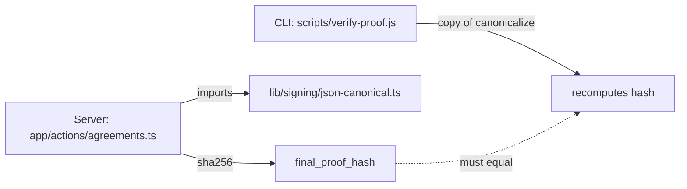

When you hash a document to anchor it on a blockchain, the hash has to be reproducible — by you tomorrow, by your verifier script, by some auditor in 2030 running a fresh Node install. The naive plan is:

```ts
const hash = sha256(JSON.stringify(payload)); // ❌ don't ship this
```

This works until the first time it doesn't, and the failure mode is **permanent**: the on-chain hash can never be rewritten. So let's enumerate the ways `JSON.stringify` quietly betrays you.

## The hidden failure modes

| Input quirk          | What `JSON.stringify` does           | Why it breaks hashing                                                  |
| -------------------- | ------------------------------------ | ---------------------------------------------------------------------- |
| Key order            | Insertion order (V8 quirks for ints) | `{a:1,b:2}` ≠ `{b:2,a:1}` → different hash                             |
| `undefined` value    | Silently dropped from objects        | Adding an optional field later changes nothing — or changes everything |
| `undefined` in array | Becomes `null`                       | Round-trip is lossy                                                    |
| `NaN` / `Infinity`   | Becomes `null`                       | Loss of information; signer and verifier might disagree                |
| `-0`                 | Becomes `0`                          | Different bytes, same hash — usually fine, but it's silent             |
| Circular reference   | Throws `TypeError`                   | DoS surface if a caller passes a user-supplied object                  |
| `BigInt`             | Throws                               | Surprises if you ever store IDs as `bigint`                            |
| `Symbol` key/value   | Dropped without warning              | Same as undefined                                                      |
| Numbers like `1e21`  | Stringified as `1e+21`               | No standardized notation across languages                              |

Most of these are dormant. The dangerous ones are **key order** and **`undefined`**, because they'll change between two engineers writing two different verifiers, or between adding an optional field in v2.

## The minimum viable canonicalizer

For WeAgree's purposes I don't need full RFC 8785 — but I do need:

1. **Deterministic key order** (`Object.keys(v).sort()`).
2. **Loud failure on unrepresentable inputs** (`undefined`, `NaN`, `Infinity`, `Symbol`, `BigInt`, `function`).
3. **Cycle detection** — refuses to crash, refuses to infinite-loop.
4. **No special number formatting** — but documented as a constraint: only safe integers and finite floats.

Here's the core, from [lib/signing/json-canonical.ts](../lib/signing/json-canonical.ts):

```ts
export function canonicalize(value: unknown): string {
  return JSON.stringify(sortValue(value, new WeakSet(), "$"));
}

function sortValue(v: unknown, seen: WeakSet<object>, path: string): unknown {
  if (v === undefined) {
    throw new CanonicalizeError(`undefined is not allowed (at ${path})`);
  }
  if (v === null) return v;

  const t = typeof v;
  if (t === "number") {
    if (!Number.isFinite(v)) {
      throw new CanonicalizeError(`non-finite number (at ${path}): ${String(v)}`);
    }
    return v;
  }
  if (t === "string" || t === "boolean") return v;
  if (t === "function" || t === "symbol" || t === "bigint") {
    throw new CanonicalizeError(`${t} is not allowed (at ${path})`);
  }

  const obj = v as object;
  if (seen.has(obj)) {
    throw new CanonicalizeError(`cyclic reference (at ${path})`);
  }
  seen.add(obj);

  if (Array.isArray(v)) {
    const out = v.map((item, i) => sortValue(item, seen, `${path}[${i}]`));
    seen.delete(obj);
    return out;
  }
  const out: Record<string, unknown> = {};
  for (const key of Object.keys(v as Record<string, unknown>).sort()) {
    out[key] = sortValue((v as Record<string, unknown>)[key], seen, `${path}.${key}`);
  }
  seen.delete(obj);
  return out;
}
```

It's 40 lines. It's tested against every failure mode in the table above. It does not have an `eslint-disable any` anywhere.

## The verifier symmetry problem

Here's the part that bit me. WeAgree has two canonicalizers:



The CLI verifier ([scripts/verify-proof.js](../scripts/verify-proof.js)) is intentionally a single self-contained file that runs with no `npm install`. It can't `import` from the app — it has to embed its own copy. So now there are **two** implementations that have to stay byte-for-byte identical. The day they drift, every previously-anchored hash becomes unverifiable.

What worked for me:

1. **A test that pins the contract.** `lib/signing/json-canonical.test.ts` has cases that any compliant implementation has to handle the same way: sorted keys, throw on `undefined`, throw on cycle, identical output for `{a:1,b:2}` and `{b:2,a:1}`.
2. **One commit that touches both files.** When I hardened the TS version, I ported the same logic into the JS verifier in the same PR.
3. **A docstring at the top of each file pointing at the other.** Future-me's grep target.

I considered moving the verifier to TypeScript and importing from `lib/`. I rejected it: the CLI has to be runnable on a stock Node install with no transpilation, by an auditor who doesn't trust me. A second canonical implementation is a feature, not a bug — it's a sanity check on the spec.

## The spec is the bug

Most "canonical JSON" stories end with "we picked RFC 8785 and used a library." That's correct for interop with other systems. For a closed signing system, the spec is whatever both your implementations agree on, and the only thing that matters is that the spec is **explicit, loud on violations, and not silently changeable**.

The version flag in the encryption envelope (`{v:1, alg:"aes-256-gcm", ...}` — see [post #1](./01-passkey-plus-ed25519.md)) exists because envelopes will change. The canonical JSON format has no version flag, on purpose: changing it would invalidate every previously-anchored hash. The only way to "fix" it later is to define a v2, leave v1 verifiable forever, and start hashing new signatures with v2.

Plan for that day. Today, just don't let `undefined` through.

## The one-liner take-away

Hash a `Map<string, unknown>` through `JSON.stringify` and you'll get `"{}"`. Hash it through a canonicalizer that throws on bad inputs and you'll get an error message that points at the line that betrayed you. Pick the second one.
