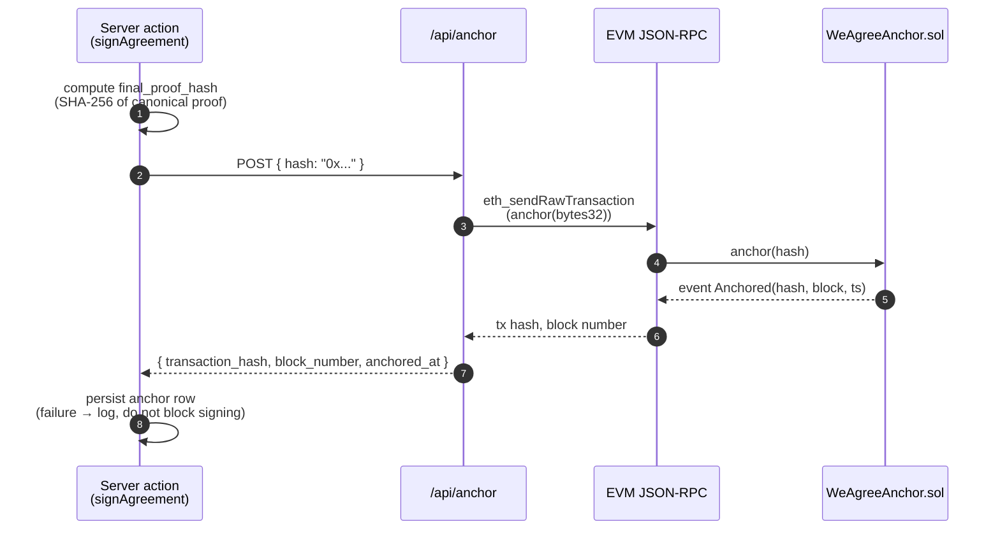

When you tell people your e-signature platform "anchors signatures on a blockchain," they imagine a Merkle tree of every signed document, a daemon batching commitments every block, a custom L2 with a paid validator set, and a cap table to match.

WeAgree's whole on-chain story is:

- One HTTP POST per finalized agreement, to a route you already control.
- One `bytes32` written to one Solidity contract on Arbitrum Sepolia.
- Total monthly cost: cents.

This post is the receipt for that decision.

## What "anchoring" actually buys you

The proof file ([scripts/verify-proof.js](../scripts/verify-proof.js)) contains everything needed to validate signatures cryptographically — the canonical payloads, the Ed25519 signatures, the public key fingerprints. So what does a chain anchor add?

**One thing**: an independently-witnessed timestamp that proves the proof file existed at or before a certain block height. The chain doesn't validate signatures. It doesn't store the document. It stores a 32-byte hash — `final_proof_hash` — and the fact that it was committed by a transaction included in a block.

That's it. That's the entire on-chain footprint, and it's enough to defeat the "you backdated this" attack that hashing alone can't defeat.

## The architecture



Key properties:

- **The signing path doesn't block on the chain.** If the RPC is down, we log and move on; the signature is already valid by itself. Anchoring is "icing on the cake" provability, not a gate.
- **One route, no daemon.** [app/api/anchor/route.ts](../app/api/anchor/route.ts) is a normal Next.js route. No separate worker, no queue, no infra.
- **The contract is a one-liner.** `mapping(bytes32 => uint256) public anchoredAt;` plus an `anchor(bytes32)` setter that emits an event. That's the whole thing.

## Why I didn't build a Merkle tree

The "obvious" optimization is to batch N final-proof-hashes into a Merkle root and anchor only the root, then store inclusion proofs alongside each agreement. For an enterprise platform doing thousands of signatures per hour, this is correct. For WeAgree it's a category error:

- **Latency tax**: now an agreement only becomes "anchored" once the next batch runs. Either you sit at "anchor pending" in the UI or you commit synchronously and lose the batching win.
- **Verifier complexity**: the CLI verifier now needs to walk a Merkle proof, not just hash a JSON file. Two implementations to maintain (see [post #2](./02-canonical-json.md)) becomes much harder.
- **Failure modes**: the batcher is now load-bearing. If it falls behind, everything queues. If it crashes, you lose unbatched anchors.
- **Cost win**: real, but on Arbitrum Sepolia we're talking fractions of a cent per anchor. The cost saving doesn't pay for one hour of debugging the batcher.

Rule I follow: **don't build infrastructure to optimize a cost that isn't measurable yet**.

## Why EVM, why Arbitrum Sepolia

I considered:

| Option                      | Pro                               | Con                                                              |
| --------------------------- | --------------------------------- | ---------------------------------------------------------------- |
| Bitcoin OP_RETURN           | Strong settlement, simple         | $5+ per anchor; UX hostile; no clean tooling for one-shot writes |
| Ethereum mainnet            | Maximum credibility               | $10+ per anchor                                                  |
| Arbitrum / Optimism testnet | Free RPC, EVM tooling, real chain | "It's testnet" footnote in compliance conversations              |
| Custom L2 / rollup          | Total control                     | Operating an L2 is its own product                               |
| Polygon                     | Cheap                             | Marketing baggage; some users actively distrust it               |

Arbitrum Sepolia won because: free RPC providers exist, ethers v6 just works, contract deployment is a couple of commands, and the cost of a real-network upgrade later is one env var flip. The [BLOCKCHAIN_EVM_RPC_URL](../.env.example) / contract address pair is configurable; there's no hardcoded chain assumption in the app code.

## The "self-anchor" trick

WeAgree's `BLOCKCHAIN_RPC_URL` doesn't have to point at a blockchain. It points at _any_ HTTP endpoint that accepts `POST { "hash": "..." }` and returns `{transaction_hash, block_number, ...}`. The default is a self-hosted Vercel route at `/api/anchor` that _itself_ talks to the EVM RPC.

Why the indirection?

- **The app server doesn't know an Ethereum private key.** Only `/api/anchor` does, and that route can be locked down with `BLOCKCHAIN_RPC_API_KEY`. Limits the blast radius of any code injection in the app.
- **Swapping chains is one env var.** Want to move to mainnet? Update the route. The signing code never changes.
- **Local dev runs without a chain.** Set `BLOCKCHAIN_RPC_URL` unset and the anchor step is skipped; signing still works end-to-end.

```ts
// lib/anchoring/chain.ts — about 40 lines, no SDK dep
const res = await fetch(rpcUrl, {
  method: "POST",
  headers: {
    "Content-Type": "application/json",
    ...(token ? { Authorization: `Bearer ${token}` } : {}),
  },
  body: JSON.stringify({ hash: finalProofHash }),
});
```

## What's missing on purpose

- **No anchor reconciliation cron.** If `/api/anchor` fails mid-flight, the signature row exists with no anchor row. I have a manual `verify:proof` CLI to spot-check; I don't have a daemon that retries. For this project, I'd rather know about a missing anchor than have a background daemon silently fixing them.
- **No anchor cost dashboard.** The contract emits events. If I cared, I'd subscribe and tally them. I don't yet.
- **No multi-chain anchoring.** Anchoring to two chains for redundancy is a Real Compliance Feature for enterprise customers. For a launch, one chain is enough.

## The take-away

A document hash on-chain is a 32-byte timestamp. You don't need an L2, a batcher, or a token. You need a contract with one `mapping`, an RPC URL, and a queue of zero. Build the rest only when someone is paying you to.
