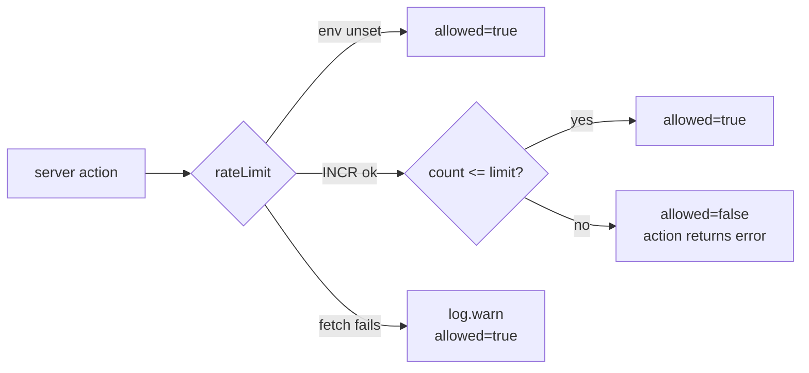

The default move when you need logging, rate limiting, or a theme toggle in a Next.js app is `npm install pino`, `npm install @upstash/ratelimit`, `npm install next-themes`. Each of these is a fine library. Each one is also more code than I needed, plus a transitive-dep liability, plus one more thing to learn before I can debug a crash.

This is a post about the three times in WeAgree I wrote the 30–80 lines instead of installing the package, and the rule I used to decide.

## The rule

> Install when the library encodes domain expertise you don't have. Write it when the library is mostly glue and you're paying the dep tax for a `README.md` you'd have to read anyway.

In the three cases below the library was glue. In every case where I _did_ install — `ethers`, `@simplewebauthn/server`, `@supabase/ssr` — the library encoded years of domain work I had no business reproducing.

## 1. Logger — 60 lines instead of `pino`

What `pino` gives you: structured JSON logs in production, child loggers, transports, async logging. The honest list of what I actually use across the WeAgree codebase: `log.info`, `log.warn`, `log.error`, and one helper for serializing caught errors. That's it.

What I wrote ([lib/log.ts](../lib/log.ts)):

```ts
const isProd = process.env.NODE_ENV === "production";

function emit(level: Level, msg: string, ctx?: LogContext): void {
  if (level === "debug" && isProd) return;
  if (isProd) {
    const record = { level, msg, time: new Date().toISOString(), ...ctx };
    const sink = level === "error" ? console.error : console.log;
    sink(JSON.stringify(record));
    return;
  }
  // dev: human-readable
  const suffix = ctx && Object.keys(ctx).length ? " " + JSON.stringify(ctx) : "";
  const sink = level === "error" ? console.error : level === "warn" ? console.warn : console.info;
  sink(`[${level}] ${msg}${suffix}`);
}

export const log = {
  debug(msg, ctx?) {
    emit("debug", msg, ctx);
  },
  info(msg, ctx?) {
    emit("info", msg, ctx);
  },
  warn(msg, ctx?) {
    emit("warn", msg, ctx);
  },
  error(msg, ctx?) {
    emit("error", msg, ctx);
  },
};
```

The **shape is pino-compatible**: `{level, msg, time, ...ctx}` JSON in prod, signature-compatible call sites. If I ever need pino's features — transports, redaction, async sinks — I delete this file, `npm install pino`, and **no call site has to change**. The optionality is the point.

What I gave up: no log levels filter at runtime, no structured-error redaction, no transports. None of those are real today.

## 2. Rate limit — 80 lines instead of `@upstash/ratelimit`

`@upstash/ratelimit` is great. It implements sliding window, token bucket, fixed window, has retry logic, includes typed responses. What I needed for WeAgree:

- "Don't let one user send 1000 invite emails per hour."
- "Don't let one user retry signing 200 times in a minute."
- "If the backend is down, **don't block users** — fail open."

Algorithm: `INCR key; EXPIRE key window`. Two Redis commands. With Upstash's REST API I don't even need a Redis client; I can `fetch` it.

```ts
// lib/ratelimit.ts
async function redisExec(args: string[]): Promise<unknown> {
  const url = envOrNull(URL_ENV);
  const token = envOrNull(TOKEN_ENV);
  if (!url || !token) throw new Error("rate-limit backend not configured");
  const res = await fetch(`${url}/${args.map(encodeURIComponent).join("/")}`, {
    method: "POST",
    headers: { Authorization: `Bearer ${token}` },
  });
  if (!res.ok) throw new Error(`Upstash ${res.status}`);
  return ((await res.json()) as { result?: unknown }).result;
}

export async function rateLimit(key: string, limit: number, windowSeconds: number) {
  if (!envOrNull(URL_ENV) || !envOrNull(TOKEN_ENV)) {
    return { allowed: true, remaining: limit, limit, resetSeconds: windowSeconds };
  }
  try {
    const count = Number((await redisExec(["INCR", key])) ?? 0);
    if (count === 1) await redisExec(["EXPIRE", key, String(windowSeconds)]);
    return {
      allowed: count <= limit,
      remaining: Math.max(0, limit - count),
      limit,
      resetSeconds: windowSeconds,
    };
  } catch (e) {
    log.warn("rate-limit backend error; failing open", { key, error: errMsg(e) });
    return { allowed: true, remaining: limit, limit, resetSeconds: windowSeconds };
  }
}
```

What I lose: token-bucket precision under burst. I don't need it. If somebody legitimately bursts in a window, they get caught a few seconds later when the next window starts. Nobody is rate-limiting their lunch break to within 100ms.

What I gain: **fails open** is the explicit default. With the SDK I'd have to read its README to find out what happens when Upstash itself is down. Here I wrote the line.



The whole thing is 80 lines including the tests' mock. The SDK + its deps is a few hundred KB.

## 3. Theme toggle — 35 lines instead of `next-themes`

`next-themes` solves the flash-of-wrong-theme problem on SSR by inserting an inline script before React hydrates. It also exposes a Context provider, a hook, three themes, a system follower. Useful if you have many components reading the current theme.

WeAgree has one place that reads the theme: the toggle button itself. So I:

1. **Wrote the inline script myself** ([app/layout.tsx](../app/layout.tsx)):

   ```html
   <script dangerouslySetInnerHTML={{ __html: `
     (function(){
       try {
         var t = localStorage.getItem('theme');
         var sys = window.matchMedia('(prefers-color-scheme: dark)').matches;
         var dark = t === 'dark' || (!t && sys);
         var c = document.documentElement.classList;
         if (dark) c.add('dark');
         if (t === 'light') c.add('light');
       } catch (e) {}
     })();
   `}} />
   ```

   It runs blocking, before the first paint. No flash.

2. **Wrote a ~50-line `ThemeToggle`** ([components/theme-toggle.tsx](../components/theme-toggle.tsx)) that cycles light → dark → system, persists to `localStorage`, applies/removes the `.dark` class on `<html>`, and listens for OS preference changes while on "system".

3. **Used Tailwind's `darkMode: "class"`** with `.dark` overrides in `globals.css`. The `.light` class wins over the media query, so a user who picks light over a system-dark OS gets light.

What I gave up: provider/hook ergonomics for reading the theme elsewhere. I don't need them. If I ever do, I'll add a Context that wraps these 50 lines.

## The pattern

In all three cases the answer to "should I install the package?" looked like:

1. **What problem does it solve that I have?** (Logger structured output, rate-limit window, no-flash theme init.)
2. **Can I implement the minimal version in under 100 lines including tests?**
3. **Does the library's API surface have an obvious "minimum viable" subset I'd actually use?**

If (2) and (3) are both yes, write it. Keep the **shape API-compatible** with the library you'd otherwise install — so the day you outgrow your version, the swap is a rename and a `npm install`.

The dep tax is real, especially in a private-key-handling codebase: every `npm install` is a security review I might not do. Every dep is an upgrade-pressure source. Every transitive dep is a CVE that might wake me up. Not installing has a real cost in features I don't get, but it has a real benefit in things that can't go wrong.

## The take-away

You don't need to be hardcore about avoiding dependencies. You need to be honest about whether the library's value to you exceeds 100 lines of obvious code. For loggers, simple rate limiters, and one-toggle theme switchers, it usually doesn't.
