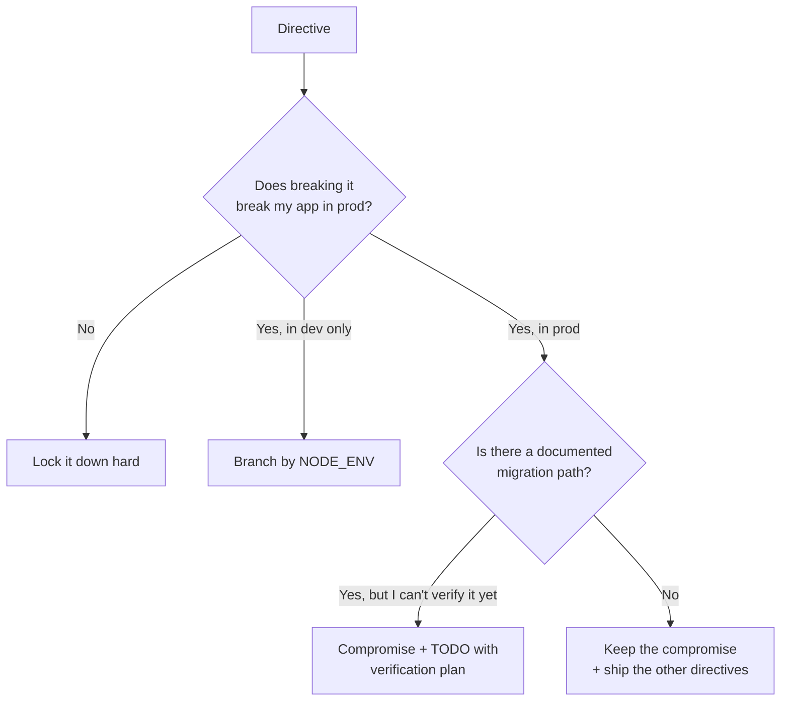

Content-Security-Policy is the single highest-leverage browser security control most apps don't ship. It also has a well-earned reputation for breaking your app silently in production at the moment your boss is showing it to a customer.

I'm one person. I have no security team. I do have one production app — [WeAgree](https://github.com/faketut/WeAgree) — that handles private signing keys and on-chain anchoring. So: how strict can I afford CSP to be, and where do I cut myself a break?

This is what I shipped and why.

## The CSP I currently run

From [next.config.mjs](../next.config.mjs):

```js
const isProd = process.env.NODE_ENV === "production";

const scriptSrc = isProd
  ? "script-src 'self' 'unsafe-inline'"
  : "script-src 'self' 'unsafe-inline' 'unsafe-eval'";

const CSP = [
  "default-src 'self'",
  scriptSrc,
  "style-src 'self' 'unsafe-inline'",
  "img-src 'self' data: blob:",
  "font-src 'self' data:",
  "connect-src 'self' https: wss:",
  "frame-ancestors 'none'",
  "base-uri 'self'",
  "form-action 'self'",
].join("; ");
```

Plus the usual suspects in the same `headers()` block: HSTS with preload, `X-Content-Type-Options: nosniff`, `Referrer-Policy: strict-origin-when-cross-origin`, `Permissions-Policy` denying camera/microphone/geolocation/FLoC, `X-Frame-Options: DENY`.

## The two compromises and why I made them

### 1. `'unsafe-inline'` on `script-src` in production

I know. The whole point of CSP is to not allow this.

The reason it's there: **Next.js 14's hydration model emits inline `__next_f.push([...])` scripts during streaming SSR**. With pure `'self'`, those scripts get blocked, hydration fails, the page is non-interactive. The fix is to switch to per-request nonces and pair them with `'strict-dynamic'`, which I'm going to do — but not before I've verified hydration works in a _live_ environment under load, because the failure mode of breaking hydration in prod is bad.

Until that verification, `'unsafe-inline'` is the deliberate, scoped compromise. It's still a meaningful improvement over the baseline of "no CSP at all," because:

- I still get `default-src 'self'` (no remote scripts).
- I still get `frame-ancestors 'none'` (no clickjacking).
- I still get `base-uri 'self'` (no DOM-clobbering via `<base>`).
- I still get `form-action 'self'` (no exfil to attacker forms).

The most common path to XSS — "attacker injects a `<script src=evil.com>`" — is still closed.

### 2. `'unsafe-eval'` allowed in dev only

React Refresh in development uses `eval`. Stripping `'unsafe-eval'` in dev breaks hot reload. So I keep it on with a guard:

```js
const isProd = process.env.NODE_ENV === "production";
// 'unsafe-eval' is dev-only.
```

The single line of branching prevents dev needs from leaking into the prod policy. I tested this by `next build && next start` locally — the prod policy strips it; the prod app still hydrates.

## What `connect-src 'self' https: wss:` is doing

This one looks loose. Why allow any HTTPS endpoint?

Because the app legitimately talks to:

- Supabase (auth + DB, varies by deployment).
- Upstash Redis REST (rate limit, optional).
- The blockchain RPC endpoint (varies by chain).

I could enumerate them, and for a v2 I will (`connect-src 'self' https://<project>.supabase.co https://<endpoint>.upstash.io ...`). But the cost-benefit is real: that allowlist has to be updated every time a customer wires up their own RPC, which would mean a deploy. For a solo project where the deployment surface is one Vercel app I own, the gain of "tightened the allowlist" vs "I have to redeploy whenever a config rotates" is not obvious.

For a multi-tenant SaaS, I'd write a middleware that builds the `connect-src` from runtime env at request time. For one app, `https:` is the considered choice.

## The decision matrix



Concretely:

| Directive                           | Decision          | Reasoning                                                 |
| ----------------------------------- | ----------------- | --------------------------------------------------------- |
| `default-src 'self'`                | Locked            | Nothing legitimate needs anywhere else                    |
| `script-src 'unsafe-inline'` (prod) | Compromise + TODO | Next.js hydration; nonce migration deferred               |
| `script-src 'unsafe-eval'` (dev)    | Branched          | React Refresh needs it; not in prod                       |
| `style-src 'unsafe-inline'`         | Compromise        | Tailwind + every component lib uses inline styles for SSR |
| `img-src 'self' data: blob:`        | Required          | Signature renderings are data URIs                        |
| `connect-src 'self' https: wss:`    | Loose             | Multi-runtime endpoints; tighten if I add a config layer  |
| `frame-ancestors 'none'`            | Locked            | We never want to be embedded                              |
| `form-action 'self'`                | Locked            | All forms post back to us                                 |
| `base-uri 'self'`                   | Locked            | Defense against DOM clobbering                            |

## The two-step plan I'd recommend

If you're a solo dev considering CSP, the failure mode I'd warn against most strongly is: **enable a strict CSP, push to prod, take it down**. Then conclude "CSP is too risky" and disable everything. The whole industry has done this and it's why so many sites still ship no CSP at all.

Step 1: ship the "compromised but real" policy above. You're getting most of the benefit immediately. `'unsafe-inline'` still beats the world where any `<script src>` works.

Step 2: when you have a staging environment and time to verify, swap to nonces:

```js
// (pseudo-code, in middleware.ts)
const nonce = crypto.randomUUID();
res.headers.set("x-nonce", nonce);
// ...then in the headers config:
("script-src 'self' 'nonce-${nonce}' 'strict-dynamic'");
```

You need to verify hydration on the routes that stream SSR — for WeAgree that's `/sign/[id]` and the dashboard — under realistic load. If it works, you can remove `'unsafe-inline'`.

I haven't done step 2 yet. I have it in the comments at the top of the CSP block, with the explicit failure mode noted, and I'd rather ship step 1 today than wait for the perfect-policy month.

## The take-away

"Solo project with no security team" is an excuse people use to ship no CSP. It shouldn't be — most of the value is in the **other** directives, not in being heroic about `script-src`. Get the easy wins on day one, label your compromises in the code, and migrate the hard parts when you can actually verify them.
