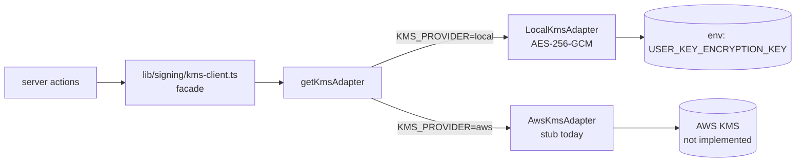

WeAgree's signing path has two things that look like the same thing but aren't:

- The **user's** Ed25519 signing key, encrypted at rest, decrypted per sign request.
- The **server's** signing identity, used to sign server-generated artifacts (anchor receipts, internal attestations).

In the original code both lived in [`lib/signing/kms-client.ts`](../lib/signing/kms-client.ts). It was ~290 lines, did its own AES-GCM, its own env validation, its own caching, and had no abstraction boundary. Which meant: when I wanted to swap the local key store for AWS KMS later, every call site had to change.

This post is about the refactor I did and the pattern I'd use again next time.

## What "swap to KMS later" actually means

The honest reason to plan for KMS-readiness in a solo project isn't "we'll need it next quarter." It's:

- **A breach response option.** "We can rotate our master key in an hour" is a real answer to a security review.
- **A compliance lever.** Some auditors will accept a KMS-backed setup and not accept a server-env-variable setup, even if they're cryptographically equivalent.
- **A scope unlock.** The day a customer says "we'll buy this if you key-isolate per tenant," I want one file to change.

It is **not** "let's run real KMS today" — KMS adds latency, cost, and IAM complexity that aren't worth it for a side project.

So the goal is: write the code today so that "swap to KMS" is a config flag and a stub-fill, not a refactor.

## The shape



Three files, one interface:

```ts
// lib/signing/kms/interface.ts
export interface KmsAdapter {
  sign(_data: Buffer): Promise<Buffer>;
  encryptAgreementContent(_plaintext: string): Promise<string>;
  decryptAgreementContent(_blob: string): Promise<string>;
}
```

(Underscore-prefixed param names so the interface declaration passes our `no-unused-vars` ESLint rule. Implementations use the unprefixed names.)

The factory is small and cached:

```ts
// lib/signing/kms/index.ts
let cached: KmsAdapter | null = null;

function selectAdapter(): KmsAdapter {
  const provider = (process.env.KMS_PROVIDER ?? "local").toLowerCase();
  const keyId = process.env.SIGNING_KEY_ID || "local-dev-key";
  if (provider === "aws") return new AwsKmsAdapter(keyId);
  return new LocalKmsAdapter(keyId, process.env.SIGNING_PRIVATE_KEY_PEM);
}

export function getKmsAdapter(): KmsAdapter {
  if (!cached) cached = selectAdapter();
  return cached;
}

export function _resetKmsAdapterForTests(): void {
  cached = null;
}
```

The AWS adapter is a stub that throws "not implemented" with a JSDoc outline of what each method needs to do (`RSASSA_PSS_SHA_256` for sign, `GenerateDataKey` for envelope encryption). When the day comes, the only file I touch is `lib/signing/kms/aws.ts`.

The original `kms-client.ts` is now a ~28-line facade:

```ts
import { getKmsAdapter } from "./kms";

export async function kmsSign(data: Buffer): Promise<Buffer> {
  return getKmsAdapter().sign(data);
}
export async function kmsEncryptAgreementContent(plaintext: string): Promise<string> {
  return getKmsAdapter().encryptAgreementContent(plaintext);
}
export async function kmsDecryptAgreementContent(blob: string): Promise<string> {
  return getKmsAdapter().decryptAgreementContent(blob);
}
```

Every call site that was already importing from `kms-client` keeps working. No diff outside `lib/signing/`.

## The two real lessons

### 1. Lazy keypair generation is OK in dev, not in prod

The `LocalKmsAdapter` will generate an ephemeral Ed25519 keypair if `SIGNING_PRIVATE_KEY_PEM` is unset. That's the right default for dev — you can clone the repo and `npm run dev` without setting up keys — but it would silently destroy the server's signing identity on every restart in production.

So:

```ts
// lib/signing/kms/local.ts
private getPrivateKey(): KeyObject {
  if (this.cachedKey) return this.cachedKey;
  const pem = this.envPem;
  if (!pem && process.env.NODE_ENV === "production") {
    throw new Error("SIGNING_PRIVATE_KEY_PEM is required in production");
  }
  // ...
}
```

One conditional, one explicit error message. The deployment failure-to-boot is **much** better than the silent-rotate-on-restart failure mode.

### 2. The test cache problem

The factory caches the adapter to avoid re-instantiating on every call. The test suite needs to mutate `process.env.SIGNING_PRIVATE_KEY_PEM` between cases and have the change take effect. Solution:

```ts
export function _resetKmsAdapterForTests(): void {
  cached = null;
}
```

Tests call `_resetKmsAdapterForTests()` in `beforeEach`. The underscore prefix signals "do not import this in app code"; ESLint is happy because the export is used (in tests); future-me has a single line to grep for if the cache behavior ever feels wrong.

I considered injecting the adapter via parameter everywhere instead of caching globally. I rejected it: it would mean threading the adapter through five layers of server actions for a benefit that's only ever realized in tests. The reset escape hatch is a smaller compromise.

## What I'd do differently

- **Encrypted content vs key-wrap.** Right now the same adapter handles both signing and content encryption. With a real AWS KMS migration I'd probably split those — KMS for key wrap (`GenerateDataKey`), then local AES-GCM for the actual content. The interface already supports this; just the implementation would change.
- **Per-tenant key isolation.** Not in the interface today. Adding it later is a `keyId` parameter on every method, which is a breaking change. If I had a clear multi-tenant signal I'd add the parameter today (defaulted to a constant for the single-tenant case).

## The pattern, generalized

The pattern is **"factory + interface + cached singleton + explicit reset for tests"**. It's how I'd write any swap-able infrastructure dependency in a small codebase. The cost is one interface file, one factory, and one "do not import in app code" escape hatch. The benefit is that the day the customer asks for it, the answer is "change `KMS_PROVIDER=aws` and fill in the stub" instead of "we need a quarter to refactor."

The pattern only pays off if you actually have a current implementation that works. **Don't write an adapter without an implementation.** A stub today + a working local impl is the minimum viable form; pure stubs are theater.

## The take-away

A 28-line facade and a stub for the future-provider isn't over-engineering — it's the smallest possible answer to "could you move to KMS if you had to?" Done at the time you write the original 290 lines, it's cheap. Done a year later under audit pressure, it's a project.
