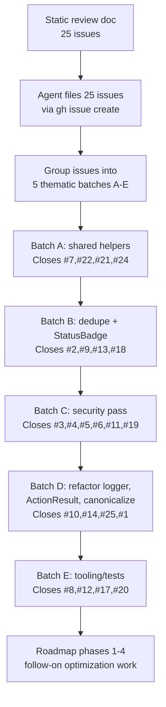

Most "LLM in my dev workflow" posts are either marketing or hand-wringing. This is neither — it's a postmortem of one week where I filed 25 GitHub issues from a static review of [WeAgree](https://github.com/faketut/WeAgree) and resolved them in five batched commits with an LLM coding agent driving the keyboard.

Numbers, what worked, what didn't, what I'd change.

## The setup

- One developer (me), one product, two months of code.
- VS Code with an agentic coding assistant. The agent can read files, run terminal commands, edit code, run tests, and call the GitHub CLI.
- A 25-item static-review document ([docs/code-quality-issues.md](../docs/code-quality-issues.md)) describing the issues in enough detail to act on without further clarification.
- Direct-to-`main` workflow. I'm the only committer. Branches and PRs would be ceremony.

## The flow

Each commit:

1. Implemented the changes for the issues it claimed.
2. Passed local lint + tests + build.
3. Used `Closes #N` in the message so issues auto-closed on push.
4. Got pushed to `main`.

Total elapsed: under a week of part-time work.

## What actually went well

**1. Batching by theme, not by file.** My first instinct was to do one issue per commit. That would have been 25 commits, mostly mechanical, each one a small mental context switch for me as reviewer. Grouping by _kind of change_ — "all the dedupe issues", "all the security headers issues" — let the agent hold the relevant code in working memory for a continuous session.

**2. A reviewable issue document.** The 25-issue doc was written before the agent saw a line of code. Each issue had:

- A short title.
- File references with line numbers.
- "Acceptance criteria" — what concrete things must be true to claim the issue is done.

That last bullet was the single highest-leverage thing in the whole workflow. Without it, the agent invents its own definition of "done", which is usually weaker than mine. With it, I could spot-check the commit by reading the diff against the criteria.

**3. Test-first verification.** After each batch the agent ran `npm test && npm run lint && npm run build` before pushing. If any failed, it diagnosed and fixed, not retried. This is the difference between "agent appears to work" and "agent actually works."

**4. Direct commits to `main`.** For a one-person repo this is the right call. PRs would have meant me self-reviewing the agent's diff in a UI, which is just reading the same diff slower. `git log -p` is faster.

## What didn't work well

**1. The agent's first instinct is to over-fix.** When asked to "remove `any` types," it would also re-format the file, add docstrings, and tighten unrelated logic. Every time I let this through, the diff got harder to review and the chance of a regression went up.

The fix was a one-line rule in my project instructions: _"Don't 'improve' adjacent code, comments, or formatting. Match existing style."_ After that the diffs were surgical. The rule lives in [/Users/fenjian/.claude/rules/rule.instructions.md](../../.claude/rules/rule.instructions.md) and equivalent.

**2. The agent did not push back enough.** A few of my 25 issues were not actually a good idea (one "improvement" would have made the code more complex for no benefit). The agent implemented them anyway. The fix: an explicit "if you think this is a bad idea, say so before implementing" line in the rule file. It now does, sometimes.

**3. Token budgets ran out at exactly the wrong time.** Halfway through Phase 3 of the follow-on roadmap, the session got summarized and I lost in-conversation context. The fix:

- **Use session memory.** I keep a `/memories/session/plan.md` that gets updated as work progresses, so a summarized agent can pick up exactly where the previous instance left off.
- **Keep commits small.** Don't let work accumulate in the agent's head longer than necessary.

**4. Two superseded contributor PRs.** Before I started, two community PRs (#26, #27) had been open against issues my agent was about to close. I closed those PRs with a comment explaining the resolution had landed differently. This is the kind of social-protocol thing the agent shouldn't do silently — it's worth a human-written close comment.

## The two-prompt workflow

Most of the "agent driving" was actually two kinds of prompts:

**Prompt A — "do the batch":**

> Implement batch C (security pass): issues #3, #4, #5, #6, #11, #19. Use the descriptions in `docs/code-quality-issues.md`. After implementing, run `npm test && npm run lint`. If anything fails, diagnose and fix. Commit with `Closes #3, Closes #4, ...` in the message. Push to main.

**Prompt B — "now do the next batch":**

> Do batch D.

Prompt B works because the rule file, the issue doc, and the session-memory plan all give the agent enough context that I don't have to re-state the workflow every time. **The setup investment pays off the longer the session lasts.**

## The post-batch roadmap

After the 25 issues closed, I had the agent do a higher-level architectural review and propose a 4-phase optimization roadmap:

- Phase 1: CI safety net + lint hardening + dep audit.
- Phase 2: KMS adapter split + CSP prod hardening.
- Phase 3: Observability (rate limit + structured logging + e2e smoke).
- Phase 4: Bundle analyzer + verify-proof consolidation + Prettier sweep.

This was the part I'd been putting off for a year. Having a single agent context that had just read every file in the codebase made the proposal credible enough to act on. I committed to it and shipped Phases 1–4 in four follow-up commits over a couple of days.

The roadmap commit pattern was the same: batch, verify, commit, push.

## What I'd change next time

- **Write the rule file before the first session, not after the first cleanup.** I lost the first day fixing patterns I should have prevented up front.
- **Don't try to estimate the agent's pace.** I kept thinking "this should be one prompt" and was wrong both directions. Some "small" issues turned out to need careful threading through five files; some "big" refactors were already half-done by existing helpers.
- **Use the commit message as a contract.** Listing every closed issue in the message makes the next session-summarized instance of the agent (and future you) able to reconstruct what landed without reading the diff.
- **Keep the verify step non-negotiable.** "Tests pass" is the cheapest reliability win. The one time I let "I think it'll be fine" slip through, it wasn't fine.

## The honest summary

LLM agents are good at:

- Mechanical refactors with explicit acceptance criteria.
- Wiring up boilerplate (CI workflows, ESLint configs, adapter scaffolds).
- Holding context across many files for one session.

LLM agents are bad at:

- Knowing when not to do the work.
- Resisting the urge to "improve" unrelated code.
- Picking up nuance from one-line prompts.

The workflow I landed on is the agent does the doing; I do the deciding. The leverage is real. The "do nothing, the AI will figure it out" version isn't.

## The take-away

If you're a solo developer with a static-review-able codebase and a working test suite, you can probably ship a quarter of mechanical cleanup in a week with an LLM agent. You'll need: an explicit rule file, an explicit acceptance-criteria-formatted issue doc, and the discipline to make the agent run tests before committing. The leverage is on the order of 3–5x for the right kind of work, and zero for the wrong kind. Knowing which kind you're looking at is the skill.
