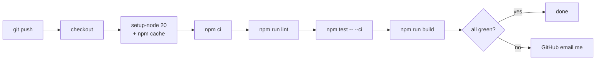

The CI you build for a team optimizes for **catching the things teammates don't catch**. The CI you build for one person optimizes for something different: **catching the things you'd skip when tired**.

This is the CI I run for [WeAgree](https://github.com/faketut/WeAgree). It's one file, four steps, runs in under three minutes, and has caught me on at least two embarrassing mistakes that would have hit prod otherwise.

## The file

[.github/workflows/ci.yml](../.github/workflows/ci.yml), in full:

```yaml
name: CI

on:
  push:
    branches: [main]
  pull_request:
    branches: [main]

jobs:
  ci:
    runs-on: ubuntu-latest
    timeout-minutes: 15
    env:
      NEXT_PUBLIC_SUPABASE_URL: https://placeholder.supabase.co
      NEXT_PUBLIC_SUPABASE_PUBLISHABLE_KEY: placeholder
      SUPABASE_SECRET_KEY: placeholder
      USER_KEY_ENCRYPTION_KEY: AAAAAAAAAAAAAAAAAAAAAAAAAAAAAAAAAAAAAAAAAAA=
    steps:
      - uses: actions/checkout@v4
      - uses: actions/setup-node@v4
        with:
          node-version: 20
          cache: npm
      - run: npm ci
      - run: npm run lint
      - run: npm test -- --ci
      - run: npm run build
```

That's it. Four steps after install: lint → test → build. No matrix, no caching tricks beyond `setup-node`'s built-in, no codecov, no Slack notifier.



## The four decisions worth explaining

### 1. Placeholder env vars in the workflow

WeAgree's code reads env vars at import time in a few places — `USER_KEY_ENCRYPTION_KEY` is required to decrypt user keys, Supabase URL/key are required to construct the client. Without these, `npm run build` fails on type-check time imports.

Two options:

- **Mock the modules.** Brittle. Drifts from production reality.
- **Pass throwaway-but-valid values.** Robust. The build is testing "does the code compile and run with _some_ valid-shaped env," which is exactly what I want.

So `USER_KEY_ENCRYPTION_KEY=AAAAAAAAAAAAAAAAAAAAAAAAAAAAAAAAAAAAAAAAAAA=` (base64-encoded 32 zero bytes) and friends are baked into the workflow. They are not secrets — they're documented as not secrets. The real values live in Vercel project settings.

### 2. `npm test -- --ci` not `npm test`

Jest's `--ci` flag changes a few behaviors:

- No prompt to write snapshots that don't exist.
- Fail (not pass) when a snapshot is missing.
- Use a deterministic worker count.

This is a one-flag difference that turns "test suite says it's green" into "test suite says it's green and you can't have accidentally written a new snapshot during this run." I want the strict version on CI.

### 3. `npm run build`, not just `next build` in a script

The `build` script in [package.json](../package.json) is `next build`, and I run the named script in CI rather than the underlying command. The reason: if I ever change what "build" means (add a prebuild step, switch to Turbo, etc.), CI follows automatically. The workflow doesn't need to know.

### 4. Lint runs before tests, tests run before build

This is the cheapest-thing-first ordering. Lint is the fastest, fails on the most issues, and fixing it is the most mechanical. Tests are next — fast-ish, fail on logic issues. Build is slowest and only catches type-check + bundler issues that the first two don't.

When a commit breaks CI, the failure is almost always lint or test. The cheap step has caught it; the expensive step never had to run. Over hundreds of CI runs this saves real minutes.

## What I don't have

**No coverage gate.** I tried. The coverage number became a thing I optimized for instead of a signal. Removed.

**No release/deploy job.** Vercel handles deploys via its GitHub integration. CI is purely "is the code green?" The deploy is downstream.

**No matrix.** Single Node version (20). When Node 22 LTS lands and I want to upgrade, I'll add a matrix temporarily during the migration, then drop it once 20 is dead. Matrices are for when you're supporting multiple versions for users; I'm not.

**No nightly job.** Nothing runs except on push/PR. If I wanted a "is the prod env still healthy" check I'd put it in a separate workflow with a `schedule` trigger. I don't have one yet.

**No Dependabot config (yet).** The one piece of low-hanging fruit I keep meaning to add. Worth doing — `.github/dependabot.yml` with npm + github-actions on weekly cadence — but the rest of CI doesn't depend on it.

## The strictness lever: ESLint config

The other half of "low-noise CI" is having an ESLint config that fails on things you actually care about. WeAgree's [.eslintrc.json](../.eslintrc.json) is short:

```json
{
  "extends": ["next/core-web-vitals"],
  "rules": {
    "no-unused-vars": ["error", { "argsIgnorePattern": "^_", "varsIgnorePattern": "^_" }],
    "no-console": ["warn", { "allow": ["warn", "error", "info", "debug"] }],
    "prefer-const": "warn",
    "eqeqeq": ["warn", "smart"]
  }
}
```

The promoted `no-unused-vars: error` is the most impactful change. Unused imports and variables are the single most common signal that a refactor was incomplete. They were warnings; warnings get ignored. Making it `error` made CI catch them. The underscore-prefix exception keeps the interface-declaration pattern viable.

`no-console: warn` with named exceptions exists so my structured logger ([lib/log.ts](../lib/log.ts) — see [post #4](./04-no-dep-receipts.md)) can keep using `console.log` for JSON output without my call sites accidentally drifting back to `console.log("debugging:", x)`.

## What CI has actually caught

In commit history order, things CI flagged that I didn't notice locally:

- An unused import after a refactor (twice).
- A missing dependency in a `useEffect` after I removed a state variable (the `react-hooks/exhaustive-deps` rule from `next/core-web-vitals`).
- A TypeScript narrowing failure that worked in `next dev` because of looser type-check, and failed in `next build`.
- A test that passed locally but failed on CI because I had a `.env.local` value the CI didn't have. Forced me to fix the test to not depend on env.

None of these are dramatic. Each one would have been an embarrassing "oh I forgot" merge.

## The take-away

CI for one person is not a smaller version of team CI. It's a different shape: fewer steps, stricter on each step, optimized for the "I'm tired and would skip checking this" case. Four steps, fifteen-minute cap, placeholder envs, single Node version. If it doesn't pay rent on every push, cut it.
